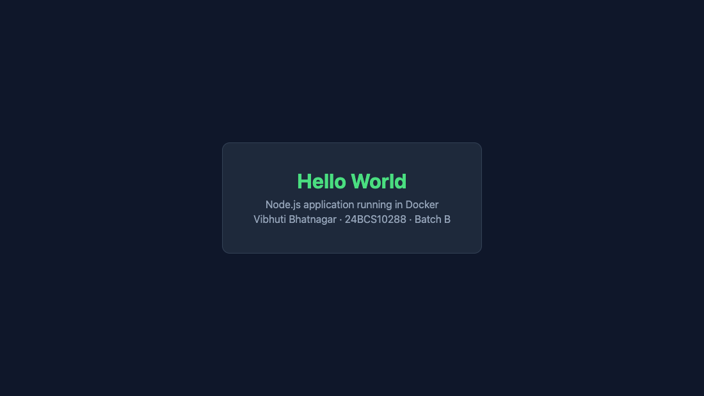
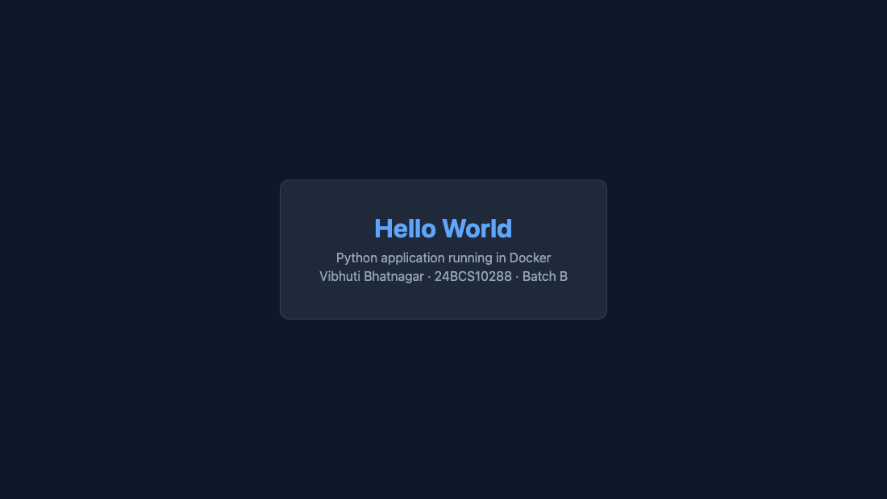
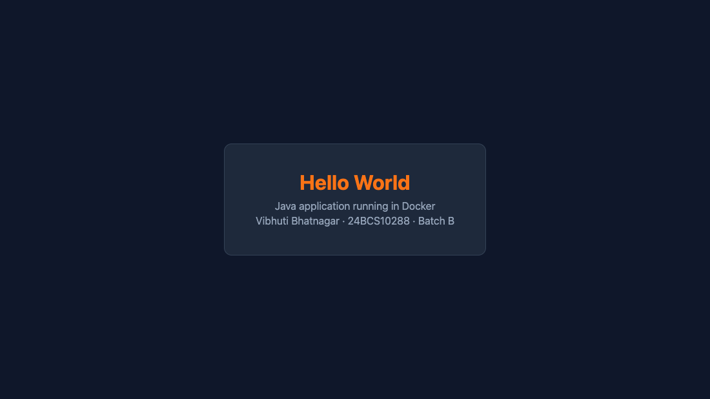
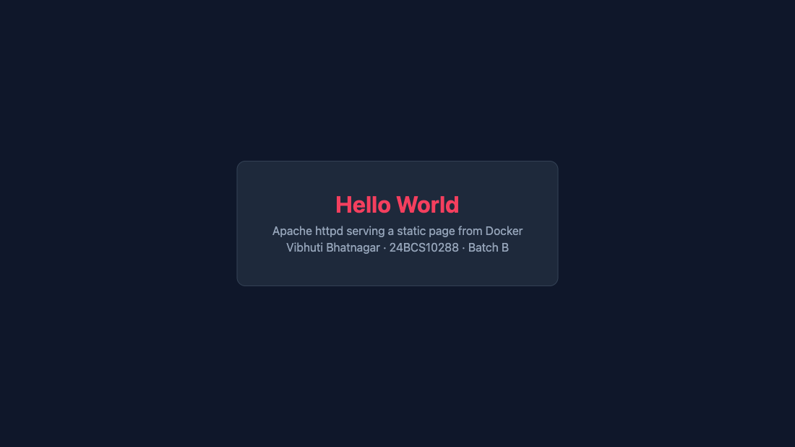
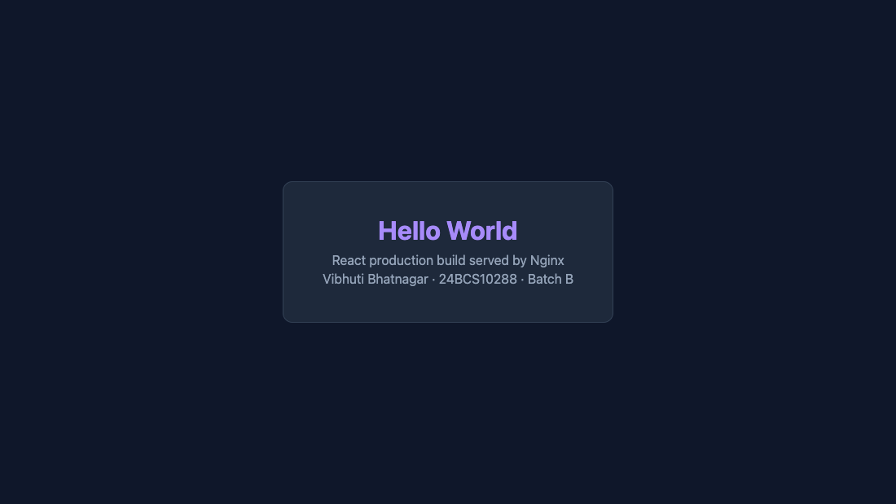
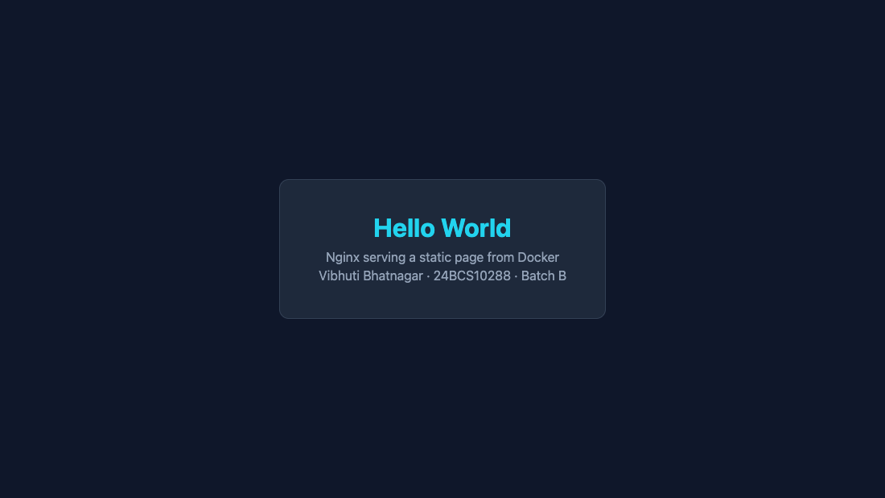
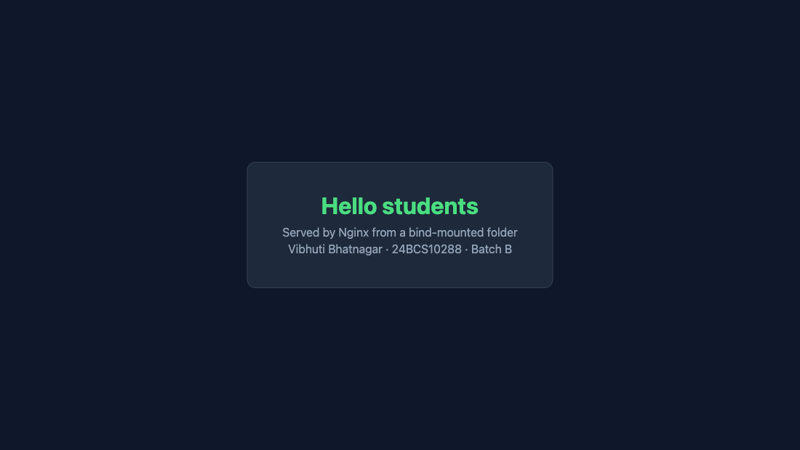
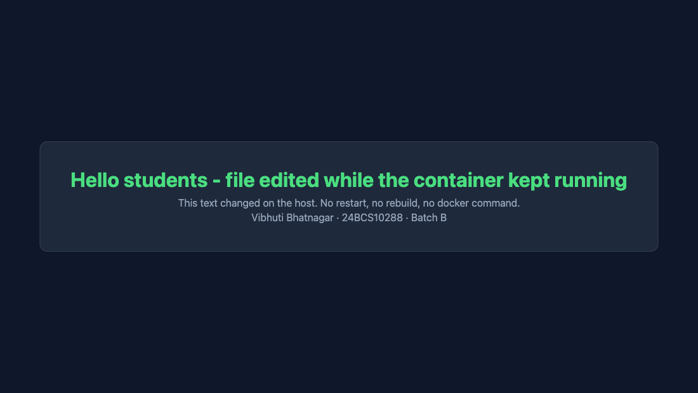

# DevOps Homework

- **Name:** Vibhuti Bhatnagar
- **Roll no:** 24BCS10288
- **Batch:** B

My work for the Linux, shell scripting, networking, Git, and Docker homework sessions. Each folder
holds the commands I ran, the captured output, and notes on what I actually observed.

## Contents

| Session topic | Work | Evidence |
| --- | --- | --- |
| Linux fundamentals | [Links, users, `journalctl`, cheat sheet](linux-fundamentals/README.md) | [lab-output.txt](linux-fundamentals/lab-output.txt), [journalctl-output.txt](linux-fundamentals/journalctl-output.txt) |
| Shell scripting | [System information script](shell-scripting/README.md) | [sample-output.txt](shell-scripting/sample-output.txt) |
| Networking | [Command practice and explanations](networking/README.md) | [command-output.txt](networking/command-output.txt) |
| Git and GitHub | [`commit -a` and cherry-pick](git-github/README.md) | [cherry-pick-output.txt](git-github/cherry-pick-output.txt) |
| Docker fundamentals | [Six Hello World applications](docker-apps/README.md) | [verification.txt](docker-apps/verification.txt) + screenshots |
| Dockerfiles and images | [Multi-stage build on port 8080](multi-stage-build/README.md) | [verification.txt](multi-stage-build/verification.txt) + screenshot |
| Docker networking and volumes | [Networks, host mode, bind mount, overlay](docker-networking/README.md) | four transcripts + screenshots |

## Screenshots

Every page below was captured from a real browser against the running container.

### Docker fundamentals — six Hello World applications

| Node.js — `:8201` | Python — `:8202` | Java — `:8203` |
| --- | --- | --- |
|  |  |  |

| Apache — `:8204` | React — `:8205` | Nginx — `:8206` |
| --- | --- | --- |
|  |  |  |

### Multi-stage build — port 8080


### Docker networking and volumes

**Task 1** — the frontend container published on port 8081, with the backend on two networks
behind it:


**Task 3** — the bind mount, before and after editing `index.html` on the host. The container was
never restarted between the two:

| Before the edit | After the edit |
| --- | --- |
|  |  |

**Task 2** (host network) has no browser screenshot, because `--network host` is not reachable
from macOS — Docker Desktop runs containers inside a Linux VM. It is verified from inside that
namespace instead, and the reason is written up in
[docker-networking/host-network/README.md](docker-networking/host-network/README.md).

**Task 4** (overlay) is a Swarm networking exercise with no web page; its evidence is the command
output in [overlay-demo-output.txt](docker-networking/overlay-demo-output.txt).

## How this is put together

Every task has a **runnable script** and a **captured transcript**, so each claim in a README can be
traced back to output from a real run rather than to a description of what should happen. Each
script cleans up after itself with a `trap`, including leaving the Swarm in the overlay demo, so
running them leaves the machine as it was.

Everything was run on macOS 26.4.1 with Docker 29.4.2. Anything that needs real Linux — `adduser`,
`useradd`, `journalctl`, `ip`, `ss` — was run inside a disposable Ubuntu container, so no test user
or stray package ever landed on my laptop.

## Running it

```bash
# Linux fundamentals
docker run --rm -v "$PWD/linux-fundamentals":/lab ubuntu:24.04 bash -c \
  'apt-get -qq update >/dev/null && apt-get -qq install -y file adduser perl >/dev/null; bash /lab/linux-lab.sh'
docker build -t vibhuti-systemd ./linux-fundamentals/systemd-image
docker run -d --name systemd-lab --privileged --cgroupns=host \
  -v /sys/fs/cgroup:/sys/fs/cgroup:rw vibhuti-systemd
docker cp linux-fundamentals/journalctl-lab.sh systemd-lab:/ && \
  docker exec systemd-lab bash /journalctl-lab.sh
docker rm -f systemd-lab

# Shell scripting
cd shell-scripting && ./system-info.sh && cd ..

# Networking
docker run --rm -v "$PWD/networking":/lab -w /lab nicolaka/netshoot bash network-checks.sh

# Git
cd git-github && ./git-lab.sh && cd ..

# Docker applications
cd docker-apps && for d in nodejs-app python-app java-app Apache-app React-app nginx-app; do
  docker build -t "vibhuti-${d%%-*}" "./$d"; done && cd ..

# Multi-stage build
docker build -t vibhuti-multi-stage ./multi-stage-build
docker run --rm -d --name vibhuti-multi-stage -p 8080:80 vibhuti-multi-stage

# Docker networking
cd docker-networking
(cd container-networking && cp .env.example .env && ./network-lab.sh)
(cd host-network && ./host-network-lab.sh)
(cd bind-mount   && ./bind-mount-lab.sh)
./overlay-demo.sh
```

## Things worth pointing out

A few results were not what I first expected, and chasing them down taught me more than the parts
that worked first time:

- **A cherry-pick can produce a byte-identical SHA.** My first cherry-pick lab picked a commit
  straight onto its own parent, so git rebuilt exactly the same object and it looked like the commit
  had moved. Giving `main` a commit of its own first makes the copy visibly a different object.
  → [git-github/README.md](git-github/README.md)

- **A bind-mounted page can be served truncated on macOS.** For about a second after a write,
  Nginx sent the new `Content-Length` with the old body, because Docker Desktop's VirtioFS cache had
  not caught up. Measured and worked around.
  → [docker-networking/bind-mount/README.md](docker-networking/bind-mount/README.md)

- **`--network host` does not reach macOS.** The container really is on port 80 of its host, but
  that host is Docker Desktop's Linux VM. Two in-namespace checks prove it works; the caveat is
  documented rather than hidden.
  → [docker-networking/host-network/README.md](docker-networking/host-network/README.md)

- **`journalctl` needs systemd as PID 1.** Rather than only describe the commands, I built an
  Ubuntu image that genuinely boots systemd so the journal, a real service, and a deliberately
  failing unit could all be inspected.
  → [linux-fundamentals/README.md](linux-fundamentals/README.md)

- **Multi-stage builds are worth measuring.** The same source built single-stage came to 449 MB
  against 76.1 MB multi-stage — about 6× — because Node, npm, and `node_modules` never reach the
  runtime image.
  → [multi-stage-build/README.md](multi-stage-build/README.md)

## Secrets

No credentials are needed to run any of this. The MySQL password in the Docker networking lab comes
from an untracked `.env`; only `.env.example` is committed, and Compose refuses to start if the
variable is unset rather than falling back to a default. The Swarm join token in the overlay
transcript is redacted.
