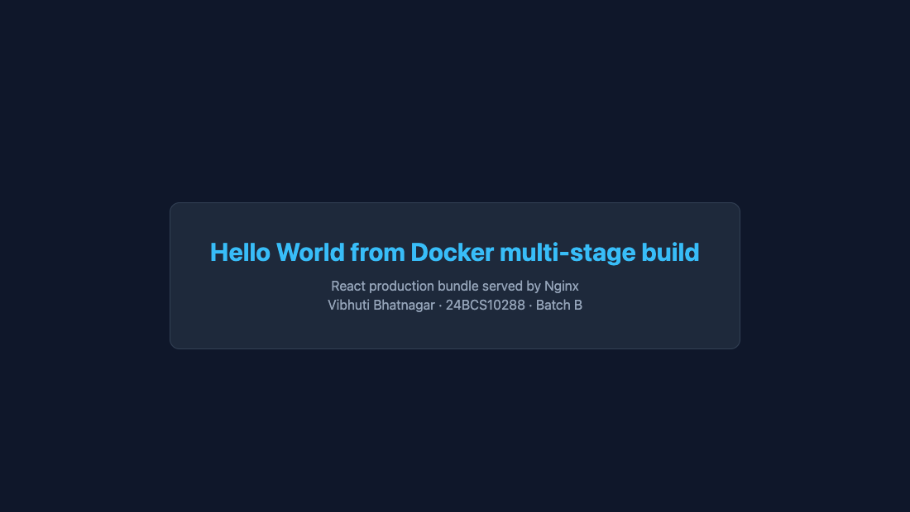
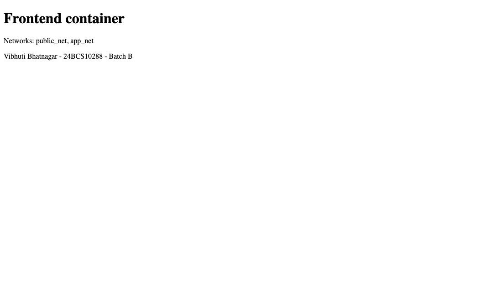
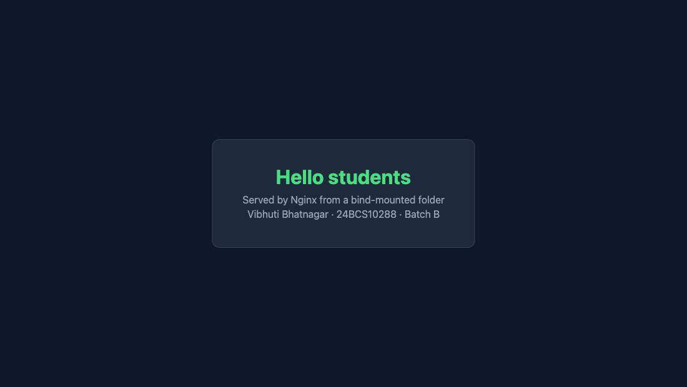
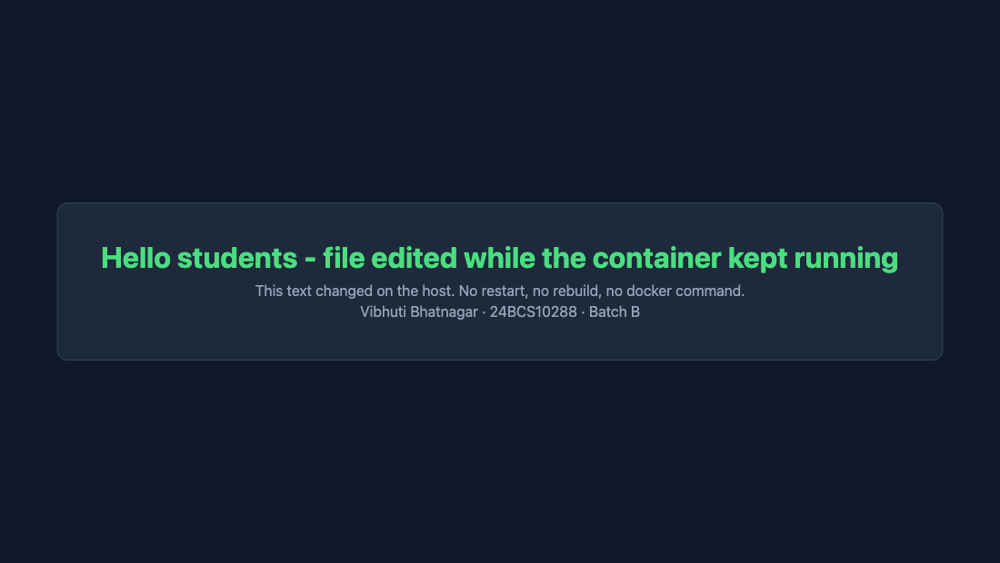

# DevOps Homework

- **Name:** Vibhuti Bhatnagar
- **Roll no:** 24BCS10288
- **Email:** vibhuti.24bcs10288@sst.scaler.com
- **Batch:** B

My work for all twenty-one homework sessions, from Linux through to the final end-to-end DevOps
project. Each folder holds the commands I ran, the captured output, and notes on what I actually
observed - including the things that did not work the first time.

## Contents

| Session topic | Work | Evidence |
| --- | --- | --- |
| Linux fundamentals | [Links, users, `journalctl`, cheat sheet](linux-fundamentals/README.md) | [lab-output.txt](linux-fundamentals/lab-output.txt), [journalctl-output.txt](linux-fundamentals/journalctl-output.txt) |
| Shell scripting | [System information script](shell-scripting/README.md) | [sample-output.txt](shell-scripting/sample-output.txt) |
| Networking | [Command practice and explanations](networking/README.md) | [command-output.txt](networking/command-output.txt) |
| Git and GitHub | [`commit -a` and cherry-pick](git-github/README.md) | [cherry-pick-output.txt](git-github/cherry-pick-output.txt) |
| Docker fundamentals | [Six Hello World applications](docker-apps/README.md) | [verification.txt](docker-apps/verification.txt) + screenshots |
| Dockerfiles and images | [Multi-stage build on port 8080](multi-stage-build/README.md) | [verification.txt](multi-stage-build/verification.txt) + screenshot |
| Docker networking and volumes | [Networks, host mode, bind mount, overlay](docker-networking/README.md) | four transcripts + screenshots |
| Kubernetes Fundamentals | [Architecture and local kind setup](kubernetes-fundamentals/README.md) | [Live evidence](evidence/kubernetes/README.md) |
| Kubernetes Pods, ReplicaSets & Deployments | [Workloads, rollout, lifecycle and strategies](kubernetes-core-objects/README.md) | [Live evidence](evidence/kubernetes/README.md) |
| Kubernetes Networking & Services | [DNS, Service types and troubleshooting](kubernetes-services/README.md) | [Live evidence](evidence/kubernetes/README.md) |
| Kubernetes Ingress, ConfigMaps & Secrets | [Routes, configuration, Secrets and TLS](kubernetes-ingress-configmaps-secrets/README.md) | [Live evidence](evidence/kubernetes/README.md) |
| Kubernetes Storage, HPA & Probes | [Volumes, autoscaling under load, and three probes](kubernetes-storage-hpa-probes/README.md) | [Live evidence](evidence/kubernetes/README.md) |
| Kubernetes Troubleshooting | [Six failures created on purpose and repaired](kubernetes-troubleshooting/README.md) | [Live evidence](evidence/kubernetes/README.md) |
| Helm | [A chart, an upgrade, a bad release and a rollback](helm/README.md) | [Live evidence](evidence/kubernetes/README.md) |
| CI/CD & GitHub Actions | [An application, its tests, and two workflows](cicd-github-actions/README.md) | [Pipeline runs](evidence/cicd/README.md) |
| Complete CI/CD & DevSecOps | [Security stages and a gate that blocked a release](devsecops/README.md) | [Scan transcripts](evidence/devsecops/README.md) |
| Terraform & Infrastructure as Code | [An S3 project and five AWS service notes](terraform-iac/README.md) | [Terraform runs](evidence/terraform/README.md) |
| Cloud & Terraform in Action | [VPC, subnets, routing, security groups, EC2, S3](cloud-terraform/README.md) | [Terraform runs](evidence/terraform/README.md) |
| Monitoring, Observability & GitOps | [Prometheus, Grafana, a firing alert, and Argo CD](monitoring-observability-gitops/README.md) | [Monitoring](evidence/monitoring/README.md) + [GitOps](evidence/kubernetes/README.md) |
| Final DevOps Project & Troubleshooting | [The whole chain, then five faults and their repair](final-devops-project/README.md) | [Live evidence](evidence/kubernetes/README.md) |

[KUBERNETES-VALIDATION.md](KUBERNETES-VALIDATION.md) records the checks executed in this
repository and the scope of what each session claims.

## Screenshots

Every page below was captured from a real browser against the running container.

### Docker fundamentals — six Hello World applications

| Node.js — `:8201` | Python — `:8202` | Java — `:8203` |
| --- | --- | --- |
|  |  |  |

| Apache — `:8204` | React — `:8205` | Nginx — `:8206` |
| --- | --- | --- |
|  |  |  |

### Multi-stage build — port 8080



### Docker networking and volumes

**Task 1** — the frontend container published on port 8081, with the backend on two networks
behind it:



**Task 3** — the bind mount, before and after editing `index.html` on the host. The container was
never restarted between the two:

| Before the edit | After the edit |
| --- | --- |
|  |  |

**Task 2** (host network) has no browser screenshot, because Docker Desktop host networking was not enabled in the recorded
macOS run. It is verified from inside that
namespace instead, and the reason is written up in
[docker-networking/host-network/README.md](docker-networking/host-network/README.md).

**Task 4** (overlay) is a Swarm networking exercise with no web page; its evidence is the command
output in [overlay-demo-output.txt](docker-networking/overlay-demo-output.txt).

### Monitoring — Prometheus, Grafana and a firing alert

The dashboard is provisioned from a file, so the stack comes up complete rather than being clicked
together:


| All four scrape targets up | `TargetDown` firing after the app was stopped |
| --- | --- |
|  |  |

The Kubernetes, CI/CD, DevSecOps and Terraform sessions have no web page to photograph. Their
evidence is the recorded command transcripts linked from each session's README.

## How this is put together

Every session has a runnable script and a recorded transcript rather than pasted output. The
Kubernetes runner records each section and retains its dedicated kind cluster for inspection;
follow the Kubernetes cleanup command when finished. The Terraform sessions target a local
AWS-compatible emulator, so no AWS account and no AWS credential is involved. The GitHub Actions
workflows are executed locally with `act`, which runs the real workflow YAML inside a container
that mirrors a GitHub-hosted runner.

Where something could not be executed in this environment, the README for that session says so and
says why: `actions/upload-artifact` needs GitHub's own artifact service, ECR is not in the
community edition of the emulator, and one S3 lifecycle resource is created by the emulator but
never satisfies the AWS provider's consistency poll. Each is behind a flag that defaults to the
value a real account needs, and each appears in a recorded `terraform plan`.

The original Docker evidence was captured on macOS 26.4.1 with Docker 29.4.2.
Versions used for the new Kubernetes checks are recorded in the validation report. Anything that needs real Linux — `adduser`,
`useradd`, `journalctl`, `ip`, `ss` — was run inside a disposable Ubuntu container, so no test user
or stray package ever landed on my laptop.

## Running it

```bash
# Linux fundamentals
docker run --rm -v "$PWD/linux-fundamentals":/lab ubuntu:24.04 bash -c \
  'apt-get -qq update >/dev/null && apt-get -qq install -y file adduser perl >/dev/null; bash /lab/linux-lab.sh'
docker build -t vibhuti-systemd ./linux-fundamentals/systemd-image
docker run -d --name systemd-lab --privileged --cgroupns=host \
  -v /sys/fs/cgroup:/sys/fs/cgroup:rw vibhuti-systemd
docker cp linux-fundamentals/journalctl-lab.sh systemd-lab:/ && \
  docker exec systemd-lab bash /journalctl-lab.sh
docker rm -f systemd-lab

# Shell scripting
cd shell-scripting && ./system-info.sh && cd ..

# Networking
docker run --rm -v "$PWD/networking":/lab -w /lab nicolaka/netshoot bash network-checks.sh

# Git
cd git-github && ./git-lab.sh && cd ..

# Docker applications
cd docker-apps && for d in nodejs-app python-app java-app Apache-app React-app nginx-app; do
  docker build -t "vibhuti-$(printf '%s' "${d%%-*}" | tr '[:upper:]' '[:lower:]')" "./$d"; done && cd ..

# Multi-stage build
docker build -t vibhuti-multi-stage ./multi-stage-build
docker run --rm -d --name vibhuti-multi-stage -p 8080:80 vibhuti-multi-stage

# Docker networking
cd docker-networking
(cd container-networking && cp .env.example .env && ./network-lab.sh)
(cd host-network && ./host-network-lab.sh)
(cd bind-mount   && ./bind-mount-lab.sh)
./overlay-demo.sh
```

For the Kubernetes sessions, follow the [local cluster setup](kubernetes-fundamentals/README.md#local-lab-setup),
then run `bash scripts/run-kubernetes-labs.sh` from the repository root.

```bash
# Tooling, downloaded into the gitignored .lab/bin and checksum-verified
#   kind v0.33.0 · helm v3.19.0 · terraform v1.16.5 · act v0.2.89

# Kubernetes sessions 9-15 and 20-21
bash scripts/run-kubernetes-labs.sh                 # or name sections, e.g. 12-helm

# CI/CD (session 16) - runs .github/workflows/ci.yml locally with act
bash scripts/run-cicd-lab.sh

# DevSecOps (session 17) - every scanner from a pinned image; exit code is the gate
bash devsecops/scripts/run-security-scan.sh

# Terraform (sessions 18, 19, 21) - against a local AWS emulator, no AWS account
docker run -d --name devops-localstack -p 4566:4566 \
  -e SERVICES=s3,ec2,ecr,sts,iam localstack/localstack:3.8
bash scripts/run-terraform-labs.sh

# Monitoring (session 20) - Prometheus, Alertmanager, Grafana, and an alert that fires
bash scripts/run-monitoring-lab.sh
```

## Things worth pointing out

A few results were not what I first expected, and chasing them down taught me more than the parts
that worked first time:

- **A cherry-pick can produce a byte-identical SHA.** My first cherry-pick lab picked a commit
  straight onto its own parent, so git rebuilt exactly the same object and it looked like the commit
  had moved. Giving `main` a commit of its own first makes the copy visibly a different object.
  → [git-github/README.md](git-github/README.md)

- **A bind-mounted page can be served truncated on macOS.** For about a second after a write,
  Nginx sent the new `Content-Length` with the old body, because Docker Desktop's VirtioFS cache had
  not caught up. Measured and worked around.
  → [docker-networking/bind-mount/README.md](docker-networking/bind-mount/README.md)

- **The recorded host-network run required Docker Desktop opt-in for access from macOS.** The container really is on port 80 of its host, but
  that host is Docker Desktop's Linux VM. Two in-namespace checks prove it works; the caveat is
  documented rather than hidden.
  → [docker-networking/host-network/README.md](docker-networking/host-network/README.md)

- **`journalctl` needs systemd as PID 1.** Rather than only describe the commands, I built an
  Ubuntu image that genuinely boots systemd so the journal, a real service, and a deliberately
  failing unit could all be inspected.
  → [linux-fundamentals/README.md](linux-fundamentals/README.md)

- **Multi-stage builds are worth measuring.** The same source built single-stage came to 449 MB
  against 76.1 MB multi-stage — about 6× — because Node, npm, and `node_modules` never reach the
  runtime image.
  → [multi-stage-build/README.md](multi-stage-build/README.md)

- **The security pipeline blocked its first release, and was right to.** Two CVEs in Flask 3.1.0
  that appeared without a line of code changing, a Bandit finding on a development entrypoint, and
  three Trivy misconfigurations in a Kubernetes manifest. Both runs are kept: the one that blocked
  and the one that passed.
  → [devsecops/README.md](devsecops/README.md)

- **An HPA with no CPU request can never scale.** It reads utilisation as a percentage of
  `requests.cpu`, so without one the metric has no denominator and the column reads `<unknown>`
  forever. The transcript shows the full 1 → 5 → 1 cycle once the request is there.
  → [kubernetes-storage-hpa-probes/README.md](kubernetes-storage-hpa-probes/README.md)

- **Every probe was green while one route returned 500.** The container served `/healthz` and
  `/readyz` perfectly and `/` raised `TemplateNotFound`, because `Flask(__name__)` looks for
  templates inside the package and the Dockerfile had copied them beside it.
  → [final-devops-project/README.md](final-devops-project/README.md)

- **Replacing a Secret does not restart the Pods that read it.** The lab failed once with a 401
  from a container still holding the previous token. Deployments now restart explicitly, and the
  Helm chart hashes its configuration into the Pod template for the same reason.
  → [final-devops-project/README.md](final-devops-project/README.md)

- **A failed rollout is not an outage.** With `maxUnavailable: 0`, an image tag that does not exist
  leaves the previous ReplicaSet serving while the new Pods sit in `ImagePullBackOff`. The
  transcript confirms the service answered throughout.
  → [final-devops-project/README.md](final-devops-project/README.md)

## Secrets

No credentials are needed to run any of this. The MySQL password in the Docker networking lab comes
from an untracked `.env`; only `.env.example` is committed, and Compose refuses to start if the
variable is unset rather than falling back to a default. The Swarm join token in the overlay
transcript is redacted. Kubernetes credentials and generated TLS keys are ignored. The Kubernetes
runner creates a disposable token without printing its value, and uses an isolated `.lab/kubeconfig`.
The final project's API token is generated at run time and never written into a transcript. The
Terraform configurations use `test`/`test` against the local emulator and no real AWS key exists on
this machine. The whole repository, including its history, is scanned by Gitleaks as part of
[the security pipeline](devsecops/README.md), with a negative control proving the scanner would
have spoken up.
