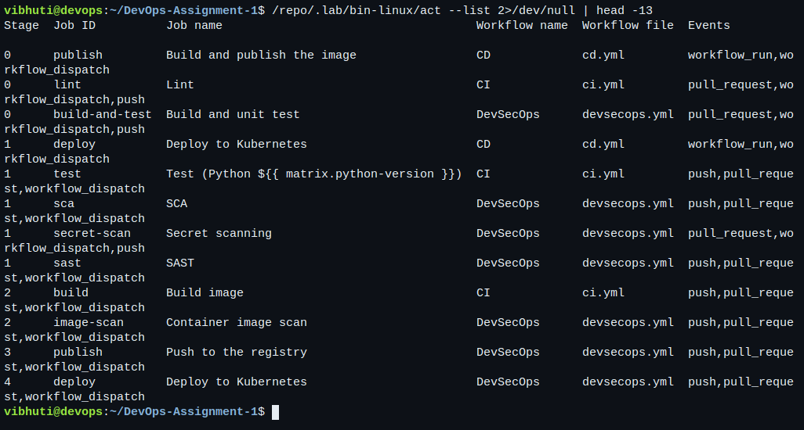
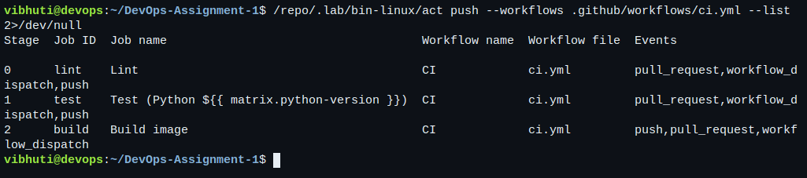
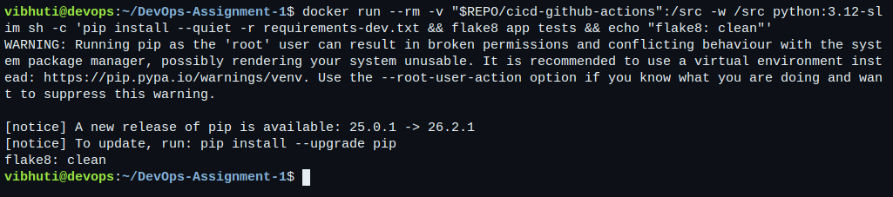
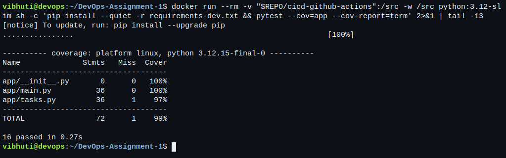
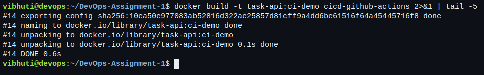
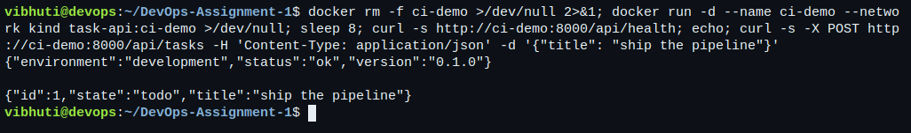
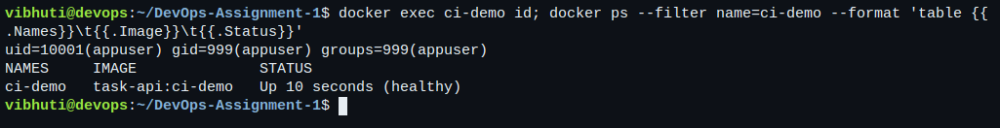
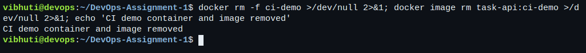

# Session 16: CI/CD & GitHub Actions

- **Name:** Vibhuti Bhatnagar
- **Roll no:** 24BCS10288
- **Email:** vibhuti.24bcs10288@sst.scaler.com
- **Batch:** B

A complete CI/CD demo project: a small Python service, unit tests, a multi-stage Dockerfile, and two
GitHub Actions workflows. The workflows were executed locally with
[act](https://github.com/nektos/act), which runs the real workflow YAML inside a container that
mirrors a GitHub-hosted `ubuntu-latest` runner. Transcripts:
[16-workflow-structure.txt](../evidence/cicd/16-workflow-structure.txt),
[16-ci-pipeline.txt](../evidence/cicd/16-ci-pipeline.txt),
[16-image-build.txt](../evidence/cicd/16-image-build.txt).

```bash
bash scripts/run-cicd-lab.sh
```

## CI vs CD

| | Continuous Integration | Continuous Delivery / Deployment |
| --- | --- | --- |
| Question it answers | "Does this change still work with everyone else's?" | "Can this change reach users safely?" |
| Trigger | Every push and every pull request. | A merge to the default branch, after CI passed. |
| Typical steps | Lint, unit test, build, package. | Publish the artefact, deploy, verify, roll back if needed. |
| Needs credentials | No. | Yes — registry and cluster. |
| In this repository | [ci.yml](../.github/workflows/ci.yml) | [cd.yml](../.github/workflows/cd.yml) |

The split is not cosmetic. CI runs on untrusted input — a pull request from a fork — so it must never
hold a secret that could be exfiltrated. CD runs only on `main` after CI has already succeeded, and
it is the only place credentials appear. `cd.yml` is triggered by `workflow_run` on CI completion and
guards on `conclusion == 'success'`, because a completed workflow can also mean completed *with a
failure*.

## The pipeline

```text
push / pull_request
        │
        ▼
   ┌─────────┐
   │  lint   │  flake8
   └────┬────┘
        │ needs: lint
        ▼
   ┌──────────────────────────┐
   │  test (matrix 3.11, 3.12)│  pytest + coverage, uploads reports
   └────┬─────────────────────┘
        │ needs: test
        ▼
   ┌─────────┐
   │  build  │  docker build, smoke test, upload image artifact
   └─────────┘
                        ── CI ends here ──
   workflow_run: CI completed successfully, branch main
        │
        ▼
   ┌──────────┐      ┌──────────┐
   │ publish  │─────▶│  deploy  │  environment: production
   └──────────┘      └──────────┘
   GHCR login+push    kubectl set image + rollout status
```

## Vocabulary, as used here

| Term | Where it is in this repository |
| --- | --- |
| **Workflow** | One YAML file under `.github/workflows/`. Three of them: CI, CD, DevSecOps. |
| **Event** | `on: push`, `pull_request`, `workflow_dispatch`, `workflow_run`. |
| **Job** | `lint`, `test`, `build`, `publish`, `deploy`. Each runs on its own fresh runner. |
| **Step** | One entry in a job's `steps:` — either `uses:` an action or `run:` a command. |
| **Runner** | `runs-on: ubuntu-latest`, a GitHub-hosted VM. Locally, the `catthehacker/ubuntu:act-latest` container. |
| **Matrix** | `strategy.matrix.python-version: ['3.11', '3.12']` — one job per value. |
| **Secret** | `secrets.GITHUB_TOKEN` for the registry, `secrets.KUBE_CONFIG` for the cluster. |
| **Artifact** | `actions/upload-artifact@v4`: the JUnit XML, the coverage XML, and the saved image. |
| **Environment** | `environment: production` on the deploy job, where an approval rule would attach. |

Jobs do not share a filesystem — that is the single most important consequence of the model.
`needs:` controls *order*, not state. Anything the next job requires has to travel as an artifact,
which is why the build job saves the image rather than assuming the test job's checkout is still
there.

## Running the workflows

`act --list` resolves each workflow's dependency graph. The `Stage` column is the order act worked
out from each job's `needs:`:

```text
Stage  Job ID  Job name                  Workflow name  Workflow file  Events
0      lint    Lint                      CI             ci.yml         push,pull_request,workflow_dispatch
1      test    Test (Python ...)         CI             ci.yml         push,pull_request,workflow_dispatch
2      build   Build image               CI             ci.yml         push,pull_request,workflow_dispatch
0      publish Build and publish the …   CD             cd.yml         workflow_run,workflow_dispatch
1      deploy  Deploy to Kubernetes      CD             cd.yml         workflow_run,workflow_dispatch
```

### Job 1 — lint

```text
[CI/Lint] ⭐ Run Main Run flake8
[CI/Lint]   ✅  Success - Main Run flake8 [360.369542ms]
[CI/Lint] 🏁  Job succeeded
```

### Job 2 — test, on both Python versions

```text
---------- coverage: platform linux, python 3.12.x-final-0 ----------
Name              Stmts   Miss  Cover
-------------------------------------
app/__init__.py       0      0   100%
app/main.py          36      0   100%
app/tasks.py         36      1    97%
-------------------------------------
TOTAL                72      1    99%

16 passed in 0.14s
```

Identical on 3.11 and 3.12. `fail-fast: false` is set so one failing version does not cancel the
other — when a version-specific break happens, you want to see which versions are affected, not just
the first one to fail.

### Job 3 — build and smoke test

The image build runs directly rather than through act: act shares the host Docker daemon, so a
nested build inside the runner would not reproduce what GitHub does.

```text
$ curl http://127.0.0.1:18800/api/health
{"environment":"development","status":"ok","version":"0.1.0"}

$ curl -X POST http://127.0.0.1:18800/api/tasks -d '{"title": "ship the pipeline"}'
{"id":1,"state":"todo","title":"ship the pipeline"}

$ docker exec ci-smoke id
uid=10001(appuser) gid=999(appuser) groups=999(appuser)

REPOSITORY   TAG        SIZE
task-api     ci-local   215MB
```

The smoke test is the step worth keeping: a green unit-test suite says the code is right, and says
nothing about whether the image starts, binds its port, or has the files it needs at runtime.

## What did not work locally, and why

**`actions/upload-artifact` cannot complete under act on this machine.** The action talks to
GitHub's artifact service; act substitutes its own server, bound by default to the host's LAN
address. macOS firewalls that address off from containers, and neither the Docker gateway address
nor a loopback alias can be bound from the host side instead, so there is no address that both ends
can reach. The step is left in the workflow unchanged — it works on GitHub — and the transcript
records the files it would have uploaded, produced by the step before it:

```text
-rw-r--r--  cicd-github-actions/coverage.xml
-rw-r--r--  cicd-github-actions/test-results.xml
<?xml version="1.0" encoding="utf-8"?><testsuites><testsuite name="pytest" errors="0" failures="0" ...
```

**The pip cache step warns and continues.** `actions/setup-python`'s cache save shells out to `tar`,
which cannot handle the spaces in this repository's absolute path on the host. A warning, not a
failure, and specific to where this checkout happens to live.

**The CD workflow is not executed.** It needs a container registry and a cluster credential. Running
it would mean putting a real GHCR token and a real kubeconfig on this machine, which is exactly the
thing `secrets.*` exists to avoid. What *is* verified is that act parses it and resolves
`publish → deploy` in the right order.

## The application

```text
cicd-github-actions/
├── app/
│   ├── tasks.py       the logic, with no HTTP in it
│   ├── main.py        the Flask routes
│   └── templates/
├── tests/
│   ├── test_tasks.py  unit tests for the rules
│   └── test_api.py    route tests through Flask's test client
├── kubernetes/        what the CD job deploys
├── Dockerfile         two-stage, non-root, with a HEALTHCHECK
├── requirements.txt
├── requirements-dev.txt
└── setup.cfg          flake8 and pytest configuration
```

The validation rules live in `tasks.py` with no Flask import, so they are tested without starting a
server. That is why the whole suite runs in 0.14 seconds, and a test suite that fast is one people
actually run before pushing.

The Dockerfile resolves dependencies into wheels in a builder stage, so the runtime image carries no
compiler and no pip cache, and runs as UID 10001 with a `HEALTHCHECK` Docker can act on.

## Terminal captures

Live captures, taken in a browser-attached terminal. The workflow listings come from `act` parsing the real files in [.github/workflows/](../.github/workflows/); the lint, test and build steps run the same commands the jobs run.

**Every workflow in the repository, with the dependency order `act` derived from each job's `needs:`.**



**The CI workflow on its own: lint, then the test matrix, then build.**



**The lint job's command — flake8 over the application and its tests.**



**The test job's command: 16 tests and the coverage report.**



**The build job's image build, from the two-stage Dockerfile.**



**The smoke test the build job runs: the image answers `/api/health`, and a real task can be created through the API. A green test suite says the code is right; this says the image actually starts.**



**The container runs as UID 10001, not root — which is what `USER 10001` in the Dockerfile is for.**



**Cleaning up the demo container and image.**


## Secrets

Nothing in this folder contains a credential.

- `secrets.GITHUB_TOKEN` is minted per workflow run by GitHub and expires when the run ends. No
  long-lived registry password exists in this repository.
- `secrets.KUBE_CONFIG` is a repository secret, written to a `0600` file under `$RUNNER_TEMP` and
  never echoed.
- `permissions:` is set explicitly per workflow — `contents: read`, `packages: write` — rather than
  relying on the default token scope.

The [Session 17 pipeline](../devsecops/README.md) adds a Gitleaks stage that scans the full history
for credentials, so this claim is checked rather than asserted.
