# Docker fundamentals — six Hello World applications

- **Name:** Vibhuti Bhatnagar
- **Roll no:** 24BCS10288
- **Email:** vibhuti.24bcs10288@sst.scaler.com
- **Batch:** B

Six small web applications, each in its own folder with its own Dockerfile. They use six different
runtimes but all return a webpage that says **Hello World**. Keeping them small makes each
Dockerfile easy to read and compare.

| Folder | Runtime | Base image | Container port | Host port |
| --- | --- | --- | ---: | ---: |
| `nodejs-app` | Node.js built-in `http` server | `node:22-alpine` | 3000 | 8201 |
| `python-app` | Python `http.server` | `python:3.12-alpine` | 5000 | 8202 |
| `java-app` | Java `com.sun.net.httpserver` | `eclipse-temurin:21` | 8080 | 8203 |
| `Apache-app` | Apache httpd static page | `httpd:2.4-alpine` | 80 | 8204 |
| `React-app` | React production build on Nginx | `node:22-alpine` → `nginx:1.27-alpine` | 80 | 8205 |
| `nginx-app` | Nginx static page | `nginx:1.27-alpine` | 80 | 8206 |

Each application gets a distinct host port so all six can run at the same time.

## Build and run one application

Run these from this folder, changing the folder, image name, and ports as needed:

```bash
docker build -t vibhuti-node ./nodejs-app
docker run --rm -d --name vibhuti-node -p 8201:3000 vibhuti-node
curl http://localhost:8201
docker stop vibhuti-node
```

## Build and run all six

```bash
docker build -t vibhuti-node   ./nodejs-app
docker build -t vibhuti-python ./python-app
docker build -t vibhuti-java   ./java-app
docker build -t vibhuti-apache ./Apache-app
docker build -t vibhuti-react  ./React-app
docker build -t vibhuti-nginx  ./nginx-app

docker run --rm -d --name vibhuti-node   -p 8201:3000 vibhuti-node
docker run --rm -d --name vibhuti-python -p 8202:5000 vibhuti-python
docker run --rm -d --name vibhuti-java   -p 8203:8080 vibhuti-java
docker run --rm -d --name vibhuti-apache -p 8204:80   vibhuti-apache
docker run --rm -d --name vibhuti-react  -p 8205:80   vibhuti-react
docker run --rm -d --name vibhuti-nginx  -p 8206:80   vibhuti-nginx

docker ps --filter name=vibhuti-
```

Every container is started with `--rm`, so stopping it also removes it:

```bash
docker stop vibhuti-node vibhuti-python vibhuti-java vibhuti-apache vibhuti-react vibhuti-nginx
```

## Verified output

The full transcript of the builds, the `curl` responses, and `docker ps` showing all six containers
running together is in [verification.txt](verification.txt).

## Screenshots

| Application | Page |
| --- | --- |
| `nodejs-app` — http://localhost:8201 | 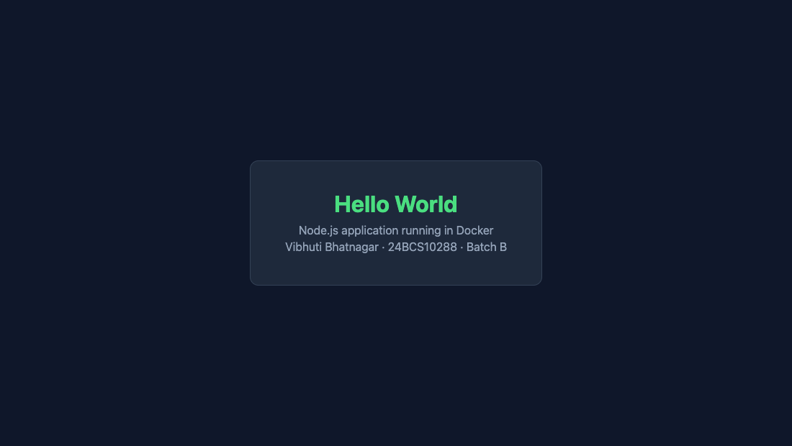 |
| `python-app` — http://localhost:8202 | 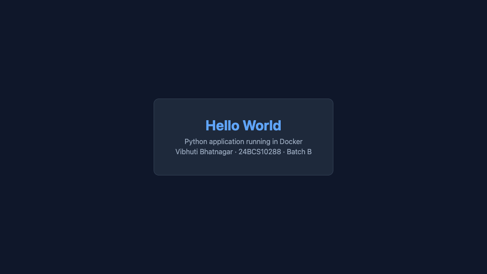 |
| `java-app` — http://localhost:8203 | 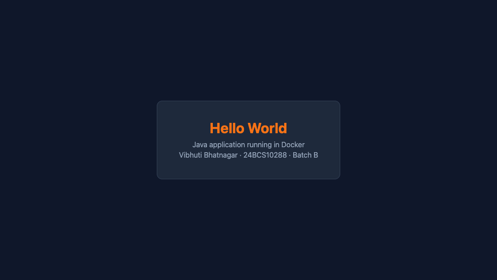 |
| `Apache-app` — http://localhost:8204 | 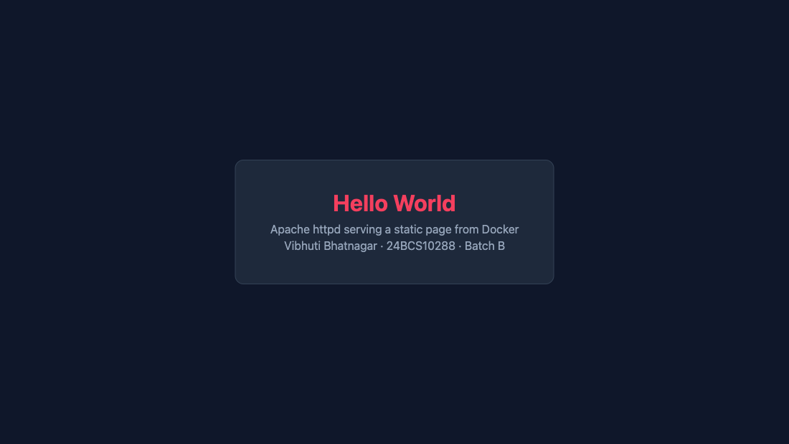 |
| `React-app` — http://localhost:8205 | 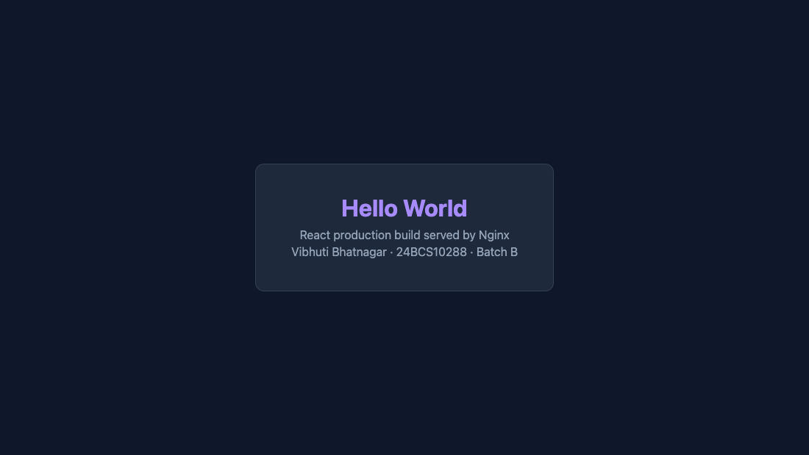 |
| `nginx-app` — http://localhost:8206 | 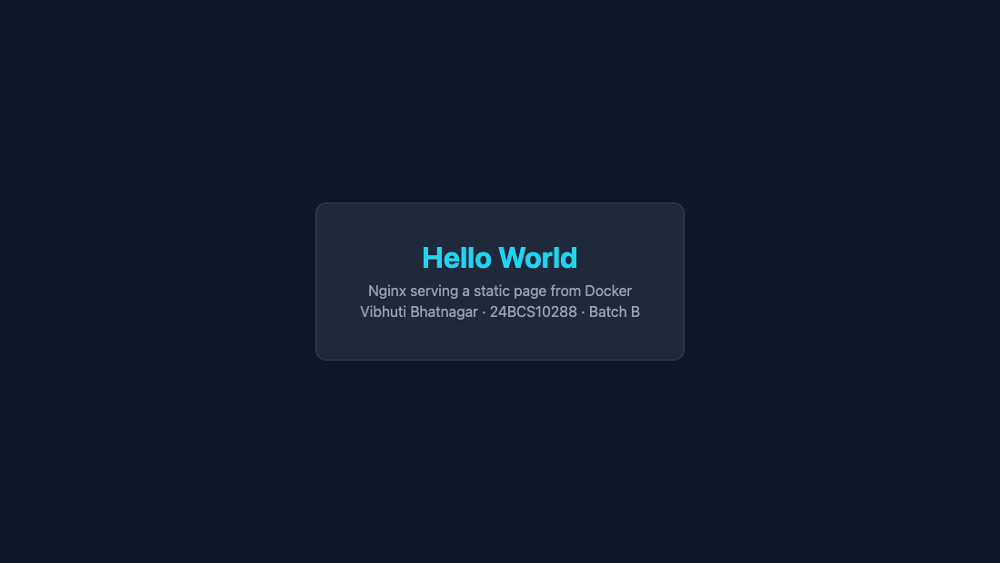 |

## Terminal captures

Live captures, taken in a browser-attached terminal. Each image was built from the Dockerfile in this folder, and each response came from the running container.

**The six images, one per runtime, with their sizes.**

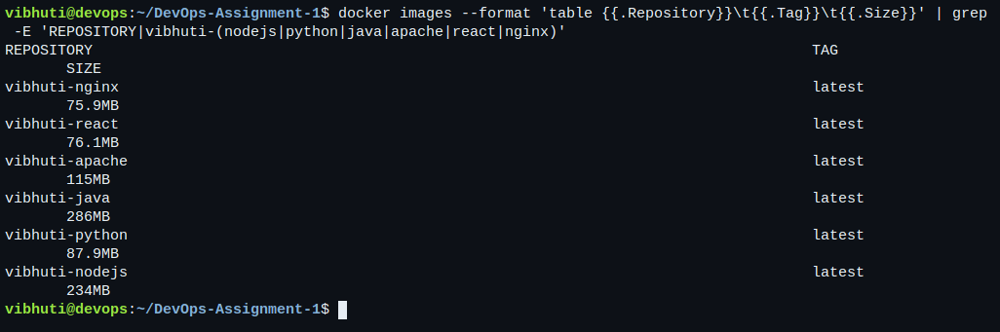

**Node.js — the built-in `http` server on `node:22-alpine`.**


**Python — `http.server` on `python:3.12-alpine`.**

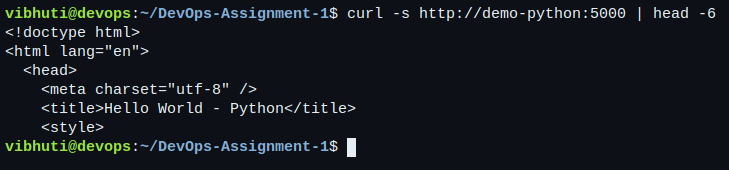

**Java — `com.sun.net.httpserver` on `eclipse-temurin:21`.**

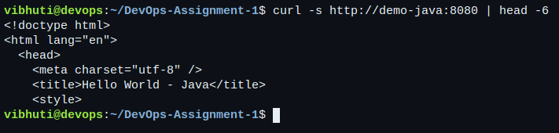

**Apache — a static page served by `httpd:2.4-alpine`.**


**React — a production build served by Nginx, from a two-stage Dockerfile.**

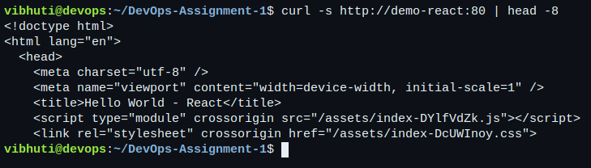

**Nginx — a static page on `nginx:1.27-alpine`.**

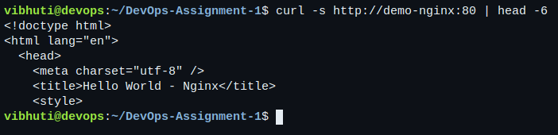

**All six running at once, each published on its own host port.**

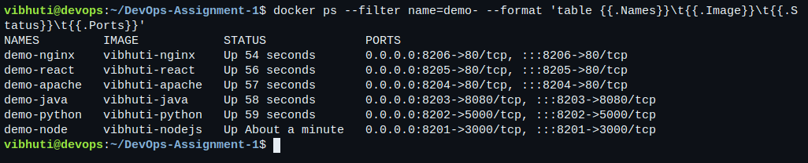
## Notes on the Dockerfiles

**Alpine base images.** Every application uses an Alpine variant. It keeps the images small
without changing how the application is written.

**Two of the images are multi-stage.** `java-app` compiles with a JDK and then ships only the
compiled `.class` files on a smaller JRE. `React-app` builds the bundle with Node and then ships
only `dist/` on Nginx, so Node and `node_modules` never reach the final image.

**No dependencies where they are not needed.** The Node and Python apps use their standard
libraries, so neither image needs a package install step at build time.

**`.dockerignore`.** The Node and React folders exclude `node_modules` and `dist` so that a local
build never copies host files into the image.
