# Session 21: Final DevOps Project

- **Name:** Vibhuti Bhatnagar
- **Roll no:** 24BCS10288
- **Email:** vibhuti.24bcs10288@sst.scaler.com
- **Batch:** B

A Notes service carried through the whole chain: source, tests, container, Kubernetes, Helm,
Terraform, CI/CD with security gates, monitoring, GitOps — and then deliberately broken five times
and repaired. Everything below was executed; transcripts are linked at each step.

```bash
# Kubernetes, monitoring and the troubleshooting challenge
docker build -t notes-app:local -f final-devops-project/docker/Dockerfile final-devops-project/application
bash scripts/run-kubernetes-labs.sh 14-final-project 15-final-monitoring 16-final-troubleshooting

# Cloud infrastructure
bash scripts/run-terraform-labs.sh
```

## 1. Project overview

The application is a small Notes service: an HTML page, a JSON API, a Prometheus `/metrics`
endpoint, separate liveness and readiness endpoints, and notes persisted to a mounted volume. It is
deliberately small, because the point of this project is everything around it.

| Concern | How it is addressed |
| --- | --- |
| Source and tests | Flask + gunicorn, 21 tests, logic separated from HTTP |
| Container | Two-stage build, non-root, read-only root filesystem |
| Orchestration | Deployment, Service, Ingress, ConfigMap, Secret, PVC, HPA, probes, NetworkPolicy |
| Packaging | A Helm chart of the same manifests |
| Infrastructure | Terraform: VPC, subnets, security group, ECR, artifacts bucket |
| CI/CD | GitHub Actions: build, test, scan, gate, publish, deploy |
| Security | SAST, SCA, secret scanning, image scanning, a gate that blocks |
| Monitoring | In-cluster Prometheus with annotation-based discovery and four alert rules |
| GitOps | An Argo CD Application with prune and self-heal |

## 2. Architecture

```text
   developer
      │ git push
      ▼
   GitHub ──────────────────────────────────────────────────┐
      │ Actions                                             │
      ├─ build ─ test ─ SAST ─ SCA ─ secret scan            │
      ├─ docker build ─ image scan ─ SECURITY GATE          │
      │                       │ blocked → stop              │
      │                       ▼ passed                      │
      ├─ push to registry (GHCR / ECR)                      │
      └─ commit the new tag ────────────────────┐           │
                                                │           │
   Terraform ──▶ VPC · subnets · SG · ECR · S3  │           │
                                                ▼           │
   Kubernetes cluster                      Argo CD ◀────────┘
   ┌──────────────────────────────────────────────────────────┐
   │ ingress-nginx ──▶ Service notes ──▶ Deployment notes (2-6)│
   │                                       │ startup probe     │
   │                                       │ readiness probe   │
   │                                       │ liveness probe    │
   │                                       ├─ ConfigMap        │
   │                                       ├─ Secret (API token)│
   │                                       └─ PVC 1Gi ─ /data  │
   │                                            ▲              │
   │                                       HPA ─┘ CPU 60%      │
   │                                                           │
   │ NetworkPolicy: default deny + ingress-nginx, monitoring, DNS│
   │                                                           │
   │ Prometheus (monitoring ns) ──▶ scrapes annotated Pods      │
   └──────────────────────────────────────────────────────────┘
```

## 3. Technologies

| Layer | Tool | Version used |
| --- | --- | --- |
| Language | Python | 3.12 |
| Framework | Flask + gunicorn | 3.1.3 / 23.0.0 |
| Metrics | prometheus-client | 0.21.1 |
| Container | Docker | 29.7.2 |
| Orchestration | Kubernetes (kind) | v1.35.0 |
| Ingress | ingress-nginx | v1.12.0 |
| Packaging | Helm | v3.19.0 |
| Infrastructure | Terraform | v1.16.5 |
| Cloud API | LocalStack | 3.8 |
| CI/CD | GitHub Actions, run locally with act | v0.2.89 |
| Security | Bandit, Semgrep, pip-audit, Gitleaks, Trivy | — |
| Monitoring | Prometheus, Alertmanager, Grafana | v3.1.0 / v0.28.0 / 11.5.1 |
| GitOps | Argo CD | v2.13.3 |

## 4. Application

```text
application/
├── notes/
│   ├── store.py      JSON persistence with atomic writes
│   ├── app.py        routes, metrics, token check
│   └── templates/
├── tests/            21 tests
├── requirements.txt
└── setup.cfg
```

| Endpoint | Purpose |
| --- | --- |
| `GET /` | HTML page listing the notes |
| `GET /healthz` | **Liveness.** The process is answering. |
| `GET /readyz` | **Readiness.** The data volume accepts writes. Returns 503 if not. |
| `GET /metrics` | Prometheus exposition |
| `GET /api/notes`, `GET /api/notes/<id>` | Read |
| `POST /api/notes`, `DELETE /api/notes/<id>` | Write — requires `X-API-Token` |

Two decisions are worth explaining.

**Liveness and readiness are different endpoints**, because they are different questions. `/healthz`
asks whether the process is alive; failing it restarts the container. `/readyz` checks that `/data`
is writable; failing it removes the Pod from the Service endpoints without restarting anything. A
replica whose volume has become read-only should stop receiving traffic, not be killed and
rescheduled onto the same broken volume.

**Writes are atomic.** `store.py` writes to a temporary file in the same directory, `fsync`s it and
`os.replace`s it over the target. A crash mid-write leaves the previous file intact rather than a
truncated one. The test suite covers the corrupt-file path explicitly.

## 5. Docker

```dockerfile
FROM python:3.12-slim AS builder     # resolve dependencies into wheels
FROM python:3.12-slim                # runtime: no compiler, no pip cache
USER 10001
HEALTHCHECK CMD python -c "... /healthz ..."
CMD ["gunicorn", "--bind", "0.0.0.0:8000", "--workers", "2", "notes.app:app"]
```

```bash
docker build -t notes-app:local -f final-devops-project/docker/Dockerfile final-devops-project/application
docker compose -f final-devops-project/docker/docker-compose.yml up -d
```

The Compose file mounts a named volume at `/data`, which is the local stand-in for the PVC, so the
same image is exercised the same way before it reaches a cluster.

## 6. Kubernetes

| Manifest | What it adds |
| --- | --- |
| [`00-namespace.yaml`](kubernetes/00-namespace.yaml) | `pod-security.kubernetes.io/enforce: restricted` |
| [`01-configmap.yaml`](kubernetes/01-configmap.yaml) | Environment and version |
| [`02-secret.yaml`](kubernetes/02-secret.yaml) | A placeholder. The real token is created out of band. |
| [`03-pvc.yaml`](kubernetes/03-pvc.yaml) | 1Gi ReadWriteOnce |
| [`04-deployment.yaml`](kubernetes/04-deployment.yaml) | 2 replicas, three probes, securityContext, `maxUnavailable: 0` |
| [`05-service.yaml`](kubernetes/05-service.yaml) | ClusterIP |
| [`06-ingress.yaml`](kubernetes/06-ingress.yaml) | `notes.devops.test` via ingress-nginx |
| [`07-hpa.yaml`](kubernetes/07-hpa.yaml) | 2–6 replicas at 60% CPU |
| [`08-networkpolicy.yaml`](kubernetes/08-networkpolicy.yaml) | Default deny, then three specific allows |

### What was verified — [transcript](../evidence/kubernetes/14-final-project.txt)

**The container is genuinely confined:**

```text
$ kubectl -n notes exec notes-… -- id
uid=10001(appuser) gid=999(appuser) groups=999(appuser),10001

$ kubectl -n notes exec notes-… -- touch /srv/should-fail
touch: cannot touch '/srv/should-fail': Read-only file system
read-only root filesystem: write refused

$ kubectl -n notes exec notes-… -- touch /data/writable
/data is writable
```

**The Secret is doing something.** An unauthenticated write is refused and an authenticated one
succeeds; the token is generated at run time and never written into the transcript:

```text
PASS: the Secret reached the container: an unauthenticated write is refused
PASS: an authenticated write is accepted
{"body":"session 21","id":3,"title":"deployed to kubernetes"}
```

**Storage outlives the Pod.** The note was written, the Pod deleted, and the replacement serves the
same note.

**The Ingress routes, and the metrics are exported:**

```text
PASS: the Ingress routes notes.devops.test to the Service
notes_stored_total 3.0
notes_storage_writable 1.0
```

**The HPA works on real load:**

| `TARGETS` | `REPLICAS` |
| --- | --- |
| `cpu: <unknown>/60%` | 2 |
| `cpu: 6%/60%` | 2 |
| `cpu: 599%/60%` | 2 |
| `cpu: 897%/60%` | 6 |
| `cpu: 253%/60%` | 6 |
| `cpu: 2%/60%` | 6 |
| `cpu: 2%/60%` | 3 |
| `cpu: 17%/60%` | 2 |

### Two caveats, stated rather than hidden

**`ReadWriteOnce` with two replicas works here only because this cluster has one node.** RWO means
one *node*, not one Pod. On a multi-node cluster the second replica would sit `Pending` with a
volume attachment error. The honest fixes are ReadWriteMany storage, or a StatefulSet with
`volumeClaimTemplates` and per-replica volumes, or moving persistence out to a database.

**The NetworkPolicy is applied, and kindnet's enforcement of it is not claimed as tested.** The
policy is correct and portable; whether this particular CNI enforces every clause is a property of
the cluster, not of the manifest.

## 7. Helm

[`helm/notes/`](helm/notes/) packages the same application with the parts that only make sense when
a chart is involved:

- `secret.yaml` generates `randAlphaNum 32` when no token is supplied, so no credential is committed.
- The PVC carries `helm.sh/resource-policy: keep`, so `helm uninstall` does not delete the data.
- `replicas` is **omitted** from the Deployment when autoscaling is enabled, so Helm and the HPA do
  not fight over the same field.
- The ConfigMap is hashed into a Pod annotation, so a configuration change actually rolls the Pods.

```bash
helm install notes final-devops-project/helm/notes -n notes --create-namespace
helm upgrade notes final-devops-project/helm/notes -n notes --set image.tag=1.1.0
helm rollback notes 1 -n notes
```

The full install → upgrade → break → rollback cycle is executed and recorded in
[Session 15](../helm/README.md).

## 8. Terraform

[`terraform/`](terraform/) provisions the cloud side: a VPC with ELB-tagged node subnets across two
Availability Zones, an ingress security group, an ECR repository with `scan_on_push` and immutable
tags, and a versioned, encrypted artifacts bucket.
[Transcript](../evidence/terraform/21-final-project-infrastructure.txt).

```text
Plan: 13 to add, 0 to change, 0 to destroy.
Apply complete! Resources: 13 added, 0 changed, 0 destroyed.
PASS: the configuration is idempotent (exit 0, no changes)
Destroy complete! Resources: 13 destroyed.
```

`image_tag_mutability = "IMMUTABLE"` is the one worth calling out: a tag that cannot be overwritten
means the image a cluster pulls is the image that was scanned, which is otherwise an assumption.

**ECR is not created in the recorded run.** It is not implemented in the community edition of the
local emulator, so the resource is behind `create_ecr_repository` (default `true`, correct for AWS)
and the transcript shows it in a plan to prove the code is real.

## 9. CI/CD and DevSecOps

The pipeline is in [Session 16](../cicd-github-actions/README.md) (build, test, package) and
[Session 17](../devsecops/README.md) (the security stages and the gate).

What that pipeline produced on its first run against this code is the part worth repeating here: it
**blocked the release** on three genuine findings — two CVEs in Flask 3.1.0, a Bandit B104 on a
development entrypoint, and three Trivy misconfigurations in a Kubernetes manifest. All three were
fixed and the second run passed. Both runs are kept.

## 10. Monitoring

[`monitoring/prometheus-k8s.yaml`](monitoring/prometheus-k8s.yaml) runs Prometheus in-cluster with a
read-only ClusterRole, discovering targets from the Kubernetes API.
[Transcript](../evidence/kubernetes/15-final-monitoring.txt).

```text
job              scrapeUrl                          health
kubernetes-pods  http://10.244.0.83:8000/metrics    up
kubernetes-pods  http://10.244.0.84:8000/metrics    up

$ promql notes_stored_total
pod notes-7f7c4d88bd-fs4jc stored notes: 3
pod notes-7f7c4d88bd-vljv7 stored notes: 3
```

Four alert rules, loaded and inactive: `NotesTargetDown`, `NotesStorageNotWritable`,
`NotesHighErrorRate` (5% of requests returning 5xx over five minutes) and `NotesSlowRequests` (p95
above one second). The first two are availability; the second two are the kind that catch a
degradation nobody would otherwise notice.

The in-cluster scrape also exercises the NetworkPolicy: Prometheus reaches the Pods because the
`monitoring` namespace is one of the three sources the policy allows.

The Docker Compose stack, its Grafana dashboard and a full alert firing-and-resolving cycle are in
[Session 20](../monitoring-observability-gitops/README.md).

## 11. GitOps

[`gitops/application.yaml`](gitops/application.yaml) points Argo CD at
`final-devops-project/kubernetes` on `main`, with `prune`, `selfHeal` and an `ignoreDifferences` on
`/spec/replicas` so the HPA keeps control of the replica count.

Argo CD reconciling a drifted cluster — an out-of-band scale, and a deleted Service — is
demonstrated live in [Session 20](../monitoring-observability-gitops/README.md#task-3-gitops).

## 12. Troubleshooting challenge

Five faults were injected into the running deployment, diagnosed and repaired.
[Transcript](../evidence/kubernetes/16-final-troubleshooting.txt). Manifests in
[`troubleshooting/faults/`](troubleshooting/faults/).

| # | Fault | Symptom | How it was found | Root cause | Fix |
| --- | --- | --- | --- | --- | --- |
| 1 | [Image tag that does not exist](troubleshooting/faults/01-wrong-image-tag.yaml) | New Pods `ErrImagePull` → `ImagePullBackOff`; rollout never completes; **service stays up** | `kubectl get pods`, then `describe` for the pull error | The tag is not in the registry | `kubectl rollout undo` |
| 2 | [Wrong Service selector](troubleshooting/faults/02-wrong-service-selector.yaml) | DNS resolves, every connection refused | `get endpointslices` empty, then `get pods --show-labels` against `describe service` | Selector `app: notes-api`, Pods labelled `app: notes` | Re-apply the correct Service |
| 3 | [Missing Secret key](troubleshooting/faults/03-missing-secret-key.yaml) | Pod scheduled, never starts: `CreateContainerConfigError` | `describe pod` — the reason is only in the events | `secretKeyRef` names a key the Secret does not have | `rollout undo` |
| 4 | [Readiness probe on the wrong path](troubleshooting/faults/04-probe-on-wrong-path.yaml) | `Running`, `0/1`, **zero restarts**, dropped from endpoints | `get pods` then `describe pod` for the probe failure | Probe points at `/health`; the app serves `/healthz` | `rollout undo` |
| 5 | [Memory limit below the working set](troubleshooting/faults/05-memory-limit-too-low.yaml) | `OOMKilled`, exit 137, then `CrashLoopBackOff` | `describe pod` → `Last State: Terminated, Reason: OOMKilled` | 24Mi limit; gunicorn with two workers needs more | `rollout undo` |

Three of these are worth a second look.

**Fault 1 was not an outage.** `maxUnavailable: 0` meant the old ReplicaSet kept serving while the
new one failed to start. The transcript confirms it: `/healthz` answered throughout. A failed
rollout and a failed service are different events, and a Deployment configured this way turns the
first into a non-incident.

**Fault 4 restarted nothing.** A failing readiness probe removes the Pod from the Service and leaves
it running — restart count stayed at 0. The same mistake in a *liveness* probe would have produced a
restart loop. That difference is the entire reason both probes exist, and it is why the readiness
probe should be the strict one.

**Fault 3 is invisible in `kubectl get`.** `CreateContainerConfigError` appears in the status column
but the actual key name is only in the events at the bottom of `describe`. Looking at logs first
finds nothing, because there is no container to have logged anything.

### One fault I did not inject

The first containerised run of the application returned HTTP 500 on `/` while `/healthz` and
`/readyz` both passed and the Pod was happily `1/1 Ready`:

```text
jinja2.exceptions.TemplateNotFound: index.html
```

The Dockerfile copied `templates/` to `/srv/templates`, but `Flask(__name__)` from `notes/app.py`
sets the application root to the `notes` package, so Flask looked in `/srv/notes/templates`. The fix
was to move the templates inside the package, where they belong in both the source tree and the
image.

It is recorded here because it is the most realistic failure in this list: every probe was green, the
Deployment reported success, and one route was broken. Health checks only check what they are pointed
at.

## 13. Lessons learned

**Probes are a design decision, not boilerplate.** Three probes with three different jobs, and
getting the split wrong converts a slow start into a restart loop or a broken replica into a silent
error page.

**A security gate is only as good as its failure mode.** Running scanners is easy. The useful part
was the run that *stopped the pipeline* and the three findings it produced — one of which, the Flask
CVEs, appeared without a single line of code changing.

**Verify through a second route.** Terraform reporting `Apply complete` is not evidence a bucket is
encrypted; `aws s3api get-bucket-encryption` is. `kubectl apply` succeeding is not evidence the app
works; a request through the Ingress is. Most of this project's transcripts are structured that way,
and it is why the Jinja2 bug was caught at all.

**Secrets are not values, they are lifecycles.** Replacing a Secret does not restart the Pods that
read it — the lab failed exactly once on that, with a 401 from a container holding the previous
token. The Deployment now carries an explicit restart, and the Helm chart hashes its configuration
into the Pod template for the same reason.

**Record what did not work.** The LocalStack lifecycle-rule timeout, ECR being unavailable, act's
artifact server being unreachable, cAdvisor's missing container names — each is a limitation of the
environment rather than of the code, and writing down which is which is the difference between a
result and a claim.

## The running application

The Notes service as served through the Ingress, listing notes created through its own API
and held on the PersistentVolumeClaim:

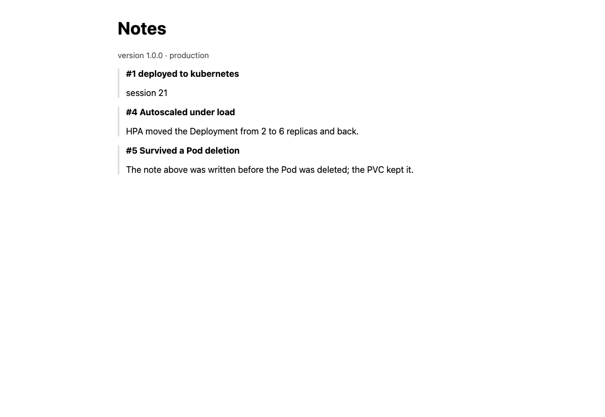

## Terminal captures

Live captures, taken in a browser-attached terminal. The browser screenshot of the application is above; these show the infrastructure and the deployed service.

**`terraform init` for the project's own cloud infrastructure.**

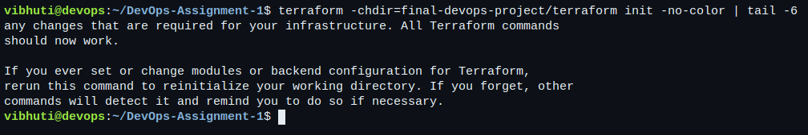

**The container registry is valid Terraform and appears in a plan. It is left out of the applied run because ECR is not implemented in the community edition of the emulator.**

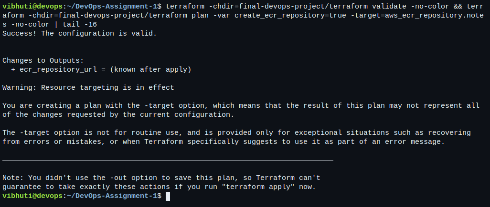

**`terraform apply` and the outputs the rest of the project would consume.**

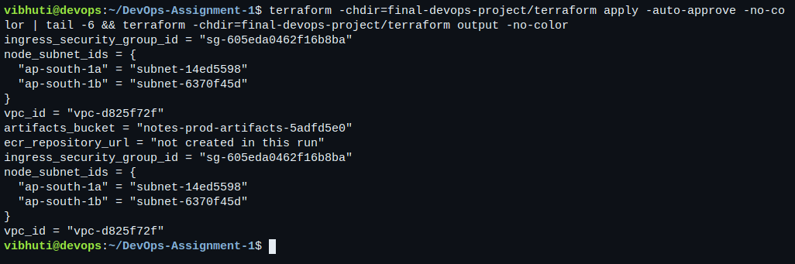

**`terraform destroy` — nothing is left behind.**

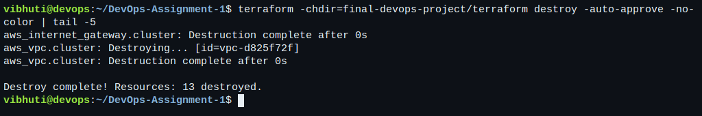

**Everything the project deploys, in one namespace: Deployment, Service, Ingress, HPA, PVC and the NetworkPolicies.**

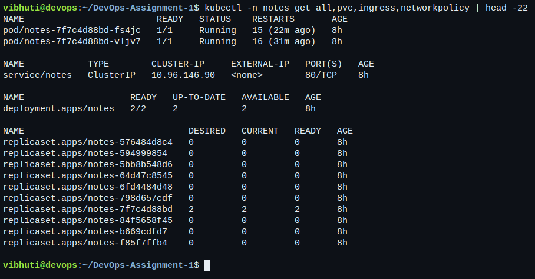

**The container is genuinely confined: it runs as UID 10001, the root filesystem refuses a write, and only the mounted data volume accepts one.**

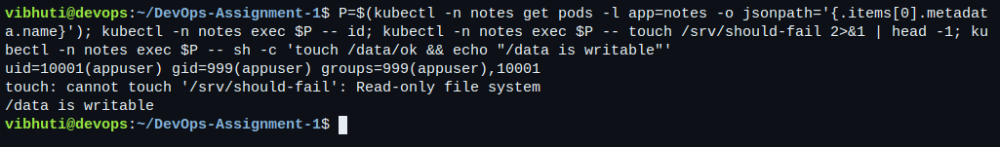

**The two probe endpoints. `/healthz` says the process is alive; `/readyz` additionally checks the data volume accepts writes.**

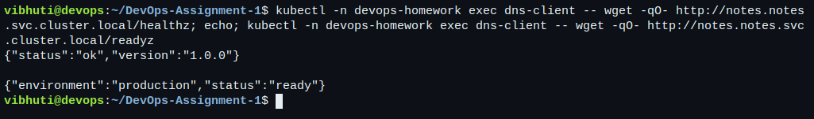

**The API, serving notes from the PersistentVolumeClaim.**

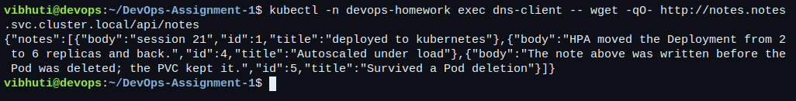

**A write without the token is refused — the Secret is doing something rather than merely existing.**

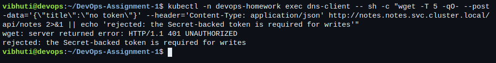

**The application's own Prometheus metrics, which the in-cluster Prometheus scrapes.**

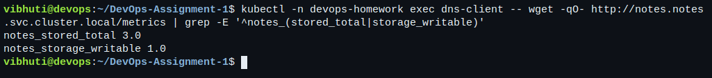

**The HorizontalPodAutoscaler and the NetworkPolicy that denies everything except the three sources the service needs.**

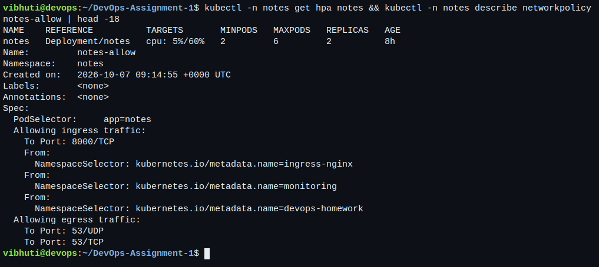
## Repository map

```text
final-devops-project/
├── application/      Flask service, tests
├── docker/           Dockerfile, .dockerignore, docker-compose.yml
├── kubernetes/       namespace, configmap, secret, pvc, deployment, service,
│                     ingress, hpa, networkpolicy, load generator
├── helm/notes/       the same application as a chart
├── terraform/        VPC, subnets, security group, ECR, artifacts bucket
├── .github/workflows/ pointer to the real workflows at the repository root
├── security/         the controls, and what they do not cover
├── monitoring/       in-cluster Prometheus, rules, RBAC
├── gitops/           the Argo CD Application
└── troubleshooting/  the five injected faults
```

## Cleanup

```bash
kubectl --context=kind-vibhuti-devops delete namespace notes monitoring
docker rm -f devops-localstack
.lab/bin/kind delete cluster --name vibhuti-devops
```
