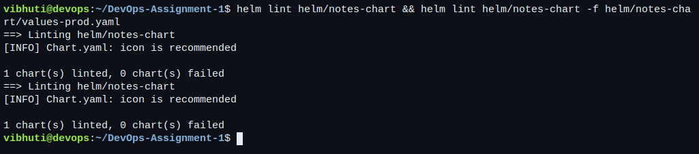
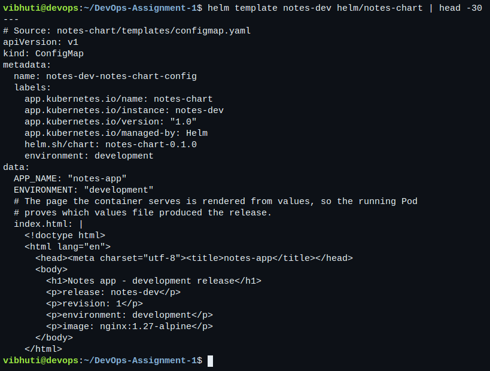
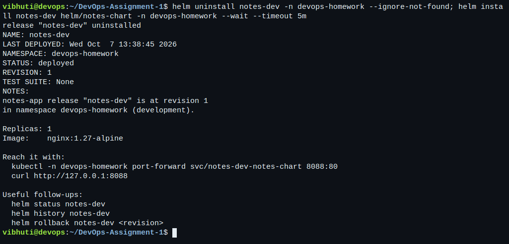
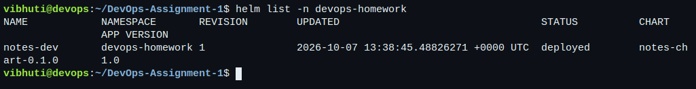
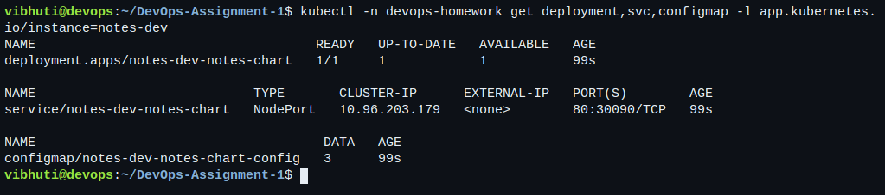
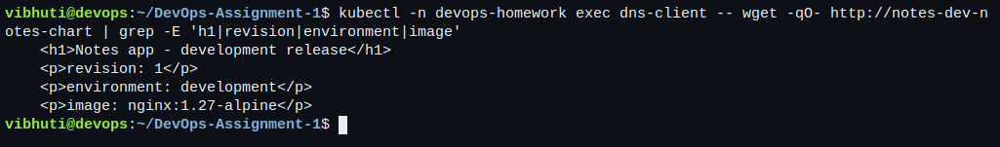
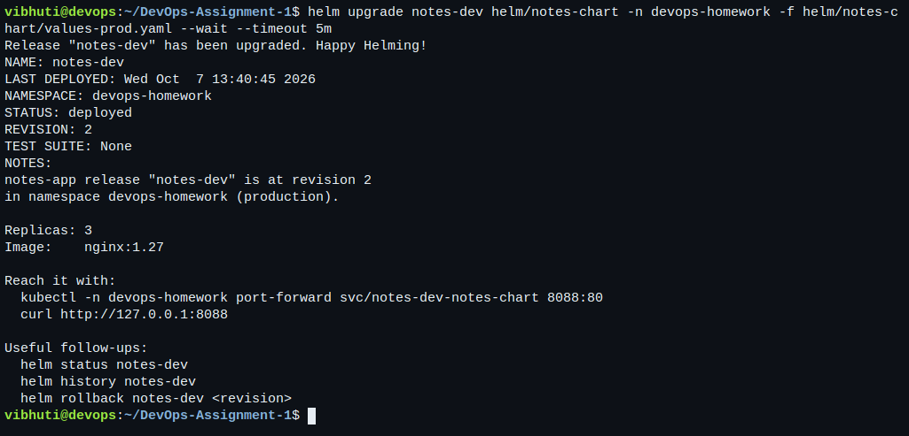
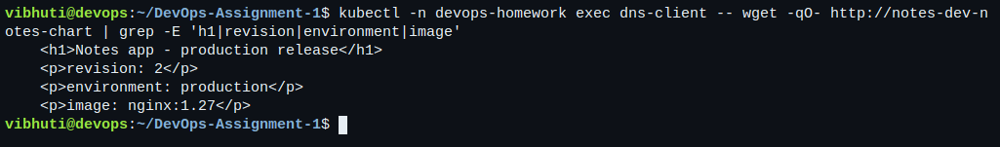
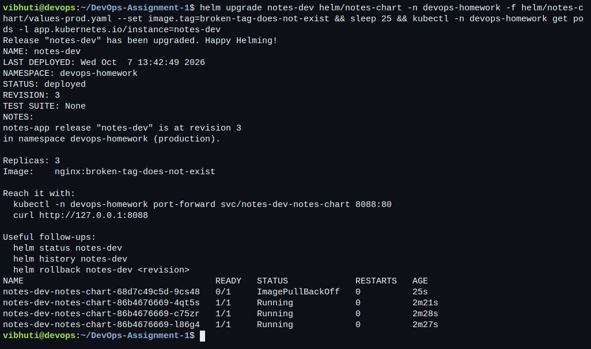
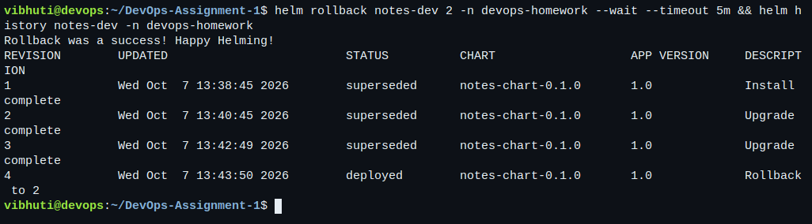

# Session 15: Helm

- **Name:** Vibhuti Bhatnagar
- **Roll no:** 24BCS10288
- **Email:** vibhuti.24bcs10288@sst.scaler.com
- **Batch:** B

A chart written from scratch, installed, upgraded, deliberately broken and rolled back on the
[local lab cluster](../kubernetes-fundamentals/README.md#local-lab-setup). The full transcript is
[12-helm.txt](../evidence/kubernetes/12-helm.txt).

```bash
bash scripts/run-kubernetes-labs.sh 12-helm
```

The runner keeps Helm's repository list and cache under `.lab/`, so running this homework does not
touch the repositories configured on the machine.

## The chart

```text
notes-chart/
├── Chart.yaml             name, chart version, appVersion
├── values.yaml            development defaults
├── values-prod.yaml       the production overrides
├── .helmignore
└── templates/
    ├── _helpers.tpl       named templates: fullname, labels, selectorLabels
    ├── configmap.yaml     environment values and the page the app serves
    ├── deployment.yaml    replicas, image, probes, resources, config checksum
    ├── service.yaml       NodePort, with the port rendered conditionally
    └── NOTES.txt          what to do next, printed after install
```

Three things in it are worth pointing at, because they are what make a chart more than a folder of
YAML with holes in it:

**The page is rendered from values.** [configmap.yaml](notes-chart/templates/configmap.yaml) builds
an `index.html` containing the release name, the revision and the environment. The running Pod
therefore *proves* which values file produced it — the verification is not "the right YAML was
applied", it is "the right thing is being served".

**The ConfigMap is hashed into the Deployment.**

```yaml
annotations:
  checksum/config: {{ include (print $.Template.BasePath "/configmap.yaml") . | sha256sum }}
```

Changing a ConfigMap does not restart the Pods that mounted it. Without this annotation, `helm
upgrade` with new values would update the ConfigMap and leave the old page being served. With it,
the Pod template changes, so the Deployment rolls.

**Names come from one helper.** `notes-chart.fullname` is `{{ .Release.Name }}-{{ .Chart.Name }}`,
defined once in [_helpers.tpl](notes-chart/templates/_helpers.tpl) and used by every template. The
release name is part of it, so the same chart can be installed twice in one namespace without
collisions.

## Task 1: the commands

### Before anything reaches the cluster

```bash
helm lint helm/notes-chart
helm lint helm/notes-chart -f helm/notes-chart/values-prod.yaml
helm template notes-dev helm/notes-chart
```

```text
==> Linting helm/notes-chart
1 chart(s) linted, 0 chart(s) failed
```

`helm template` renders locally and talks to no cluster. It is the fastest way to find a templating
mistake, and the rendered output in the transcript shows every `{{ }}` replaced.

### Install

```bash
helm install notes-dev helm/notes-chart -n devops-homework --wait --timeout 5m
helm list -n devops-homework
helm status notes-dev -n devops-homework
helm get values notes-dev -n devops-homework
helm get manifest notes-dev -n devops-homework
```

```text
NAME: notes-dev
LAST DEPLOYED: Wed Oct  7 13:22:26 2026
NAMESPACE: devops-homework
STATUS: deployed
REVISION: 1
```

`helm get values` shows what was supplied; `helm get manifest` shows what was actually sent to the
API server. When a release does not look like the chart, those two commands answer "were the right
values used" and "did they render to the right objects" separately.

Served page at revision 1:

```html
<h1>Notes app - development release</h1>
<p>release: notes-dev</p>
<p>revision: 1</p>
<p>environment: development</p>
<p>image: nginx:1.27-alpine</p>
```

### Upgrade

```bash
helm upgrade notes-dev helm/notes-chart -n devops-homework -f helm/notes-chart/values-prod.yaml --wait
helm history notes-dev -n devops-homework
```

```text
REVISION  STATUS      DESCRIPTION
1         superseded  Install complete
2         deployed    Upgrade complete
```

One replica becomes three, the image becomes `nginx:1.27`, and the page now reads
`production` / `revision: 2`. The ConfigMap checksum is what made the Pods roll.

### Repositories and search

```bash
helm repo add ingress-nginx https://kubernetes.github.io/ingress-nginx
helm repo list
helm repo update
helm search repo ingress-nginx --versions
helm search hub nginx
```

`helm search repo` looks in the indexes already added locally; `helm search hub` queries Artifact
Hub over the network. A repository is nothing more than an `index.yaml` listing chart versions and
the URLs of their packaged `.tgz` files.

## Task 2: the rollback workflow

```text
install (rev 1, development, 1 replica)
   ↓
upgrade -f values-prod.yaml (rev 2, production, 3 replicas)   ← verified
   ↓
upgrade --set image.tag=broken-tag-does-not-exist (rev 3)     ← broken on purpose
   ↓
rollback to 2 (rev 4)                                         ← verified again
```

The bad upgrade:

```bash
helm upgrade notes-dev helm/notes-chart -n devops-homework \
  -f helm/notes-chart/values-prod.yaml --set image.tag=broken-tag-does-not-exist
kubectl -n devops-homework get pods -l app.kubernetes.io/instance=notes-dev
```

```text
NAME                                     READY   STATUS             RESTARTS   AGE
notes-dev-notes-chart-6c6c69cd57-54hxx   0/1     ImagePullBackOff   0          12s
notes-dev-notes-chart-86b4676669-wvnmk   1/1     Running            0          16s
```

Two details matter here. First, `helm upgrade` **reported success** — without `--wait` or `--atomic`
it only confirms the objects were accepted, not that the Pods became healthy. Second, the service
never went down: the rolling update kept the old ReplicaSet serving because the new Pod never became
Ready. A broken release and an outage are not the same event.

The rollback:

```bash
helm rollback notes-dev 2 -n devops-homework --wait --timeout 5m
helm history notes-dev -n devops-homework
```

```text
REVISION  STATUS      DESCRIPTION
1         superseded  Install complete
2         superseded  Upgrade complete
3         superseded  Upgrade complete
4         deployed    Rollback to 2
```

Note that the rollback is revision **4**, not a return to revision 2. Helm's history is append-only;
"rolling back" applies the old manifest as a new revision, so the failed revision 3 is still on
record. That is what makes the history useful afterwards.

### Install, upgrade, rollback — what each one actually does

| Command | Effect on the cluster | Effect on history |
| --- | --- | --- |
| `helm install` | Creates every object in the chart. | Revision 1. |
| `helm upgrade` | Diffs the rendered manifest against the stored one and patches the difference. | A new revision. |
| `helm rollback N` | Re-applies the manifest stored in revision N. | Another new revision. |
| `helm uninstall` | Deletes the objects. | Removes the release; `--keep-history` retains it. |

Helm stores each revision as a Secret in the release namespace (`sh.helm.release.v1.notes-dev.v1`
and so on), which is why `helm history` keeps working after the Pods are gone, and why the release
is visible to anyone with read access to that namespace.

## Task 3: Mini project

The brief's Notes app is this chart. All fifteen steps were executed: directory, `Chart.yaml`,
`values.yaml`, `values-prod.yaml`, the three templates, lint, render, install, verify, upgrade to
production values, history, a bad upgrade, rollback, verify, uninstall. The transcript follows that
order.

The chart here goes slightly beyond the brief: readiness and liveness probes, resource requests and
limits, labels following the `app.kubernetes.io/*` convention, and the configuration checksum. The
probes are what let `--wait` mean something; the labels are what let `kubectl get all -l
app.kubernetes.io/instance=notes-dev` return exactly this release.

Uninstall leaves nothing behind:

```bash
helm uninstall notes-dev -n devops-homework
kubectl -n devops-homework get deployment,svc,configmap -l app.kubernetes.io/instance=notes-dev
```

```text
No resources found in devops-homework namespace.
```

## The same chart, used by the final project

[final-devops-project/helm/notes](../final-devops-project/helm/notes/) is a larger version of this
chart for the real application: a PVC with `helm.sh/resource-policy: keep`, a Secret whose token is
generated by `randAlphaNum` rather than committed, an optional Ingress, and an HPA that is only
rendered when autoscaling is enabled — with `replicas` omitted from the Deployment in that case, so
Helm and the autoscaler do not fight over the same field.

## Terminal captures

Live captures of the full install, upgrade, break and rollback cycle against the running kind cluster.

**`helm lint` against both the default and the production values files.**



**`helm template` renders locally and talks to no cluster — the fastest way to find a templating mistake.**



**`helm install` at revision 1.**



**`helm list` — the release, its revision and its chart version.**



**The objects the chart created, selected by the release label.**



**The page the running Pod serves at revision 1 — rendered from `values.yaml`, so it proves which values produced the release.**



**`helm upgrade` onto the production values file.**



**The same page at revision 2 — production values, a different image tag. The ConfigMap checksum annotation is what made the Pods roll.**



**A deliberately broken upgrade. Helm reports success because `--wait` was omitted, while the new Pod sits in ImagePullBackOff and the old one keeps serving.**



**`helm rollback` to revision 2. Note it is recorded as revision 4 — Helm's history is append-only, so the failed revision stays on the record.**


## Cleanup

```bash
helm uninstall notes-dev -n devops-homework   # the runner already does this
rm -rf .lab/helm                               # the lab's own Helm configuration
```
