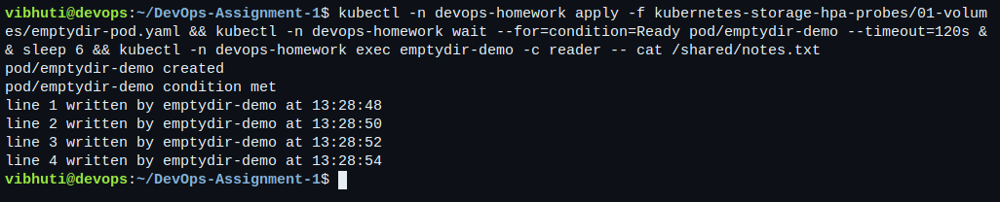
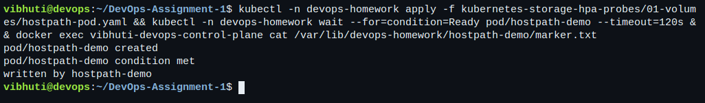
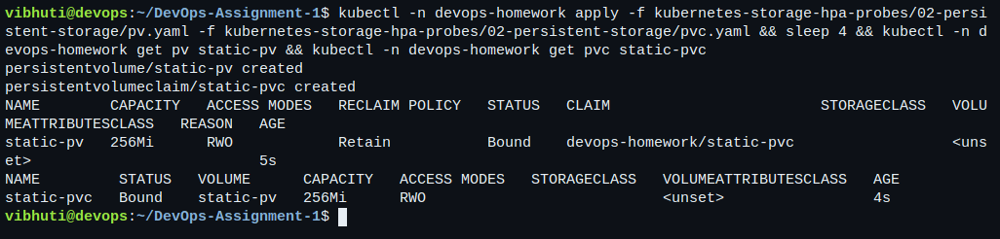
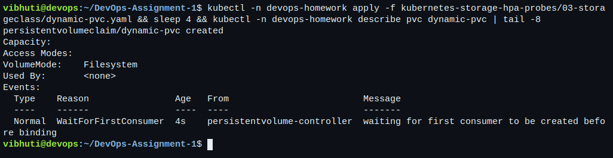
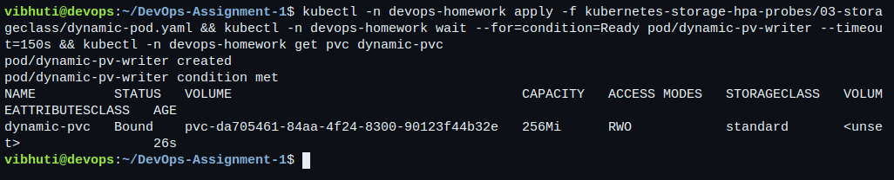
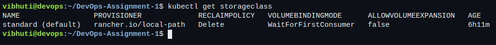
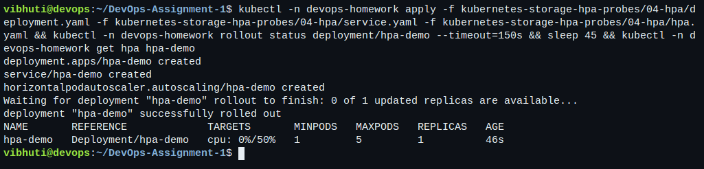
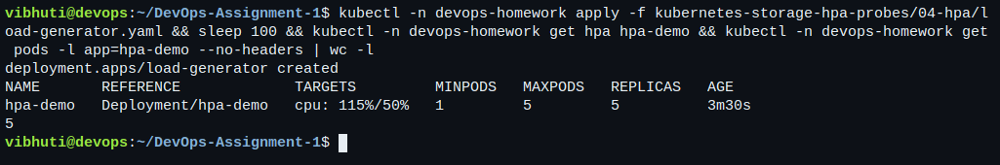
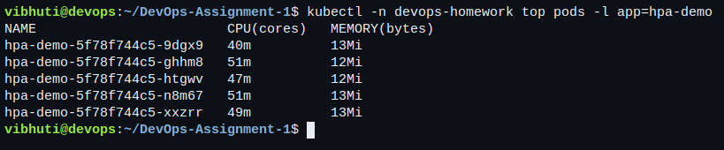
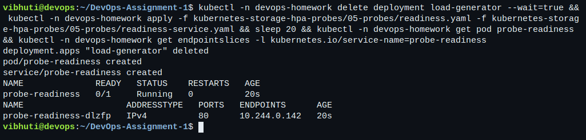

# Session 13: Kubernetes Storage, HPA & Probes

- **Name:** Vibhuti Bhatnagar
- **Roll no:** 24BCS10288
- **Email:** vibhuti.24bcs10288@sst.scaler.com
- **Batch:** B

Everything below was run on the [disposable local lab](../kubernetes-fundamentals/README.md#local-lab-setup)
with a metrics-server installed. The transcripts are
[07-storage.txt](../evidence/kubernetes/07-storage.txt),
[08-hpa-probes.txt](../evidence/kubernetes/08-hpa-probes.txt) and
[09-webapp-mini-project.txt](../evidence/kubernetes/09-webapp-mini-project.txt);
every number quoted here is from those files.

```bash
# once per cluster, for the HPA sections
kubectl --context=kind-vibhuti-devops apply -f \
  https://github.com/kubernetes-sigs/metrics-server/releases/download/v0.8.0/components.yaml
kubectl --context=kind-vibhuti-devops -n kube-system patch deployment metrics-server --type=json \
  -p='[{"op":"add","path":"/spec/template/spec/containers/0/args/-","value":"--kubelet-insecure-tls"}]'

bash scripts/run-kubernetes-labs.sh 07-storage 08-hpa-probes 09-webapp-mini-project
```

`--kubelet-insecure-tls` is needed because kind's kubelets serve a self-signed certificate that
the metrics-server does not trust. It is a lab setting, not something to carry into a real cluster.

## Task 1: Volumes

| Volume type | Manifest | Lifetime | Scope |
| --- | --- | --- | --- |
| `emptyDir` | [emptydir-pod.yaml](01-volumes/emptydir-pod.yaml) | The Pod. Deleted with it. | Shared by every container in that Pod. |
| `hostPath` | [hostpath-pod.yaml](01-volumes/hostpath-pod.yaml) | The node's disk. Outlives the Pod. | One node only. |
| `PersistentVolume` | [pv.yaml](02-persistent-storage/pv.yaml) | Independent of any Pod. | Cluster-wide object. |
| `PersistentVolumeClaim` | [pvc.yaml](02-persistent-storage/pvc.yaml) | Namespaced request for storage. | Bound to exactly one PV. |
| `StorageClass` | kind's default `standard` | A template, not storage. | Creates PVs on demand. |

### emptyDir — one volume, two containers

The Pod runs a writer and a reader against the same `emptyDir`. The reader sees what the writer
appended, which is the point: `emptyDir` is how containers in one Pod share a filesystem.

```bash
kubectl -n devops-homework exec emptydir-demo -c reader -- cat /shared/notes.txt
```

```text
line 1 written by emptydir-demo at 07:24:10
line 2 written by emptydir-demo at 07:24:12
```

Deleting the Pod deletes the directory with it. There is nothing to inspect afterwards, which is
exactly why `emptyDir` suits scratch space and caches and nothing else.

### hostPath — the node's own filesystem

```bash
kubectl -n devops-homework exec hostpath-demo -- cat /node/marker.txt
docker exec vibhuti-devops-control-plane cat /var/lib/devops-homework/hostpath-demo/marker.txt
```

Both print `written by hostpath-demo`. After the Pod is deleted the file is **still there** on the
node — the transcript reads it again with `docker exec` after the delete. That is the useful half
of `hostPath` and also the dangerous half: the data is tied to one machine, so a Pod rescheduled
elsewhere sees an empty directory, and a mounted host path is a straightforward way to escape the
container. It belongs in node-level agents, not in applications.

### PersistentVolume and PersistentVolumeClaim — static binding

`storageClassName: ""` on both objects is what makes this binding genuinely static: it stops the
default provisioner answering the claim, so the claim can only bind to the PV written by hand.
The `selector` then picks it by label.

```text
NAME        CAPACITY   ACCESS MODES   RECLAIM POLICY   STATUS   CLAIM                        AGE
static-pv   256Mi      RWO            Retain           Bound    devops-homework/static-pvc   4s

NAME         STATUS   VOLUME      CAPACITY   ACCESS MODES   STORAGECLASS   AGE
static-pvc   Bound    static-pv   256Mi      RWO            <unset>        0s
```

The claim asks for 128Mi and binds to a 256Mi volume. Kubernetes binds the *smallest suitable*
volume; a claim never shrinks a PV, so the extra capacity is simply unused.

A Pod writes `Vibhuti Bhatnagar 24BCS10288` into `/data/student.txt`, the Pod is deleted, an
identical Pod is created, and the file is still there. That one sequence is the whole argument for
persistent volumes.

### StorageClass and dynamic provisioning

```text
NAME                 PROVISIONER             RECLAIMPOLICY   VOLUMEBINDINGMODE      AGE
standard (default)   rancher.io/local-path   Delete          WaitForFirstConsumer   4m39s
```

Applying [dynamic-pvc.yaml](03-storageclass/dynamic-pvc.yaml) alone leaves the claim `Pending`:

```text
Events:
  Type    Reason                Age   From                         Message
  Normal  WaitForFirstConsumer  0s    persistentvolume-controller  waiting for first consumer to be created before binding
```

That is not a fault. `WaitForFirstConsumer` delays provisioning until a Pod is scheduled, so the
volume is created in the same zone or on the same node as the Pod that will use it. Creating the
consumer Pod immediately produces the volume:

```text
NAME                                       CAPACITY   RECLAIM POLICY   STATUS   CLAIM                          STORAGECLASS   AGE
pvc-e820ba7e-e95c-4e5f-8c59-a99ab60373c7   256Mi      Delete           Bound    devops-homework/dynamic-pvc    standard       2s
```

Two differences from the static volume are worth noticing: the name is generated, and the reclaim
policy is `Delete` rather than `Retain`. Deleting the claim deletes the data. The hand-written PV
keeps it.

## Task 2: Horizontal Pod Autoscaler

[deployment.yaml](04-hpa/deployment.yaml) requests `cpu: 50m`, [hpa.yaml](04-hpa/hpa.yaml) targets
50% utilisation between 1 and 5 replicas, and [load-generator.yaml](04-hpa/load-generator.yaml)
runs four looping clients.

```bash
kubectl -n devops-homework get hpa hpa-demo
kubectl -n devops-homework top pods -l app=hpa-demo
kubectl -n devops-homework describe hpa hpa-demo
```

The whole scale-out and scale-in, taken from the transcript:

| Observation | `TARGETS` | `REPLICAS` |
| --- | --- | --- |
| Idle, before load | `cpu: 0%/50%` | 1 |
| First reading under load | `cpu: 212%/50%` | 1 |
| HPA reacts | `cpu: 594%/50%` | 2 |
| Still above target | `cpu: 389%/50%` | 4 |
| Ceiling reached | `cpu: 223%/50%` | 5 |
| Load spread over five Pods | `cpu: 29%/50%` | 5 |
| Load generator deleted | `cpu: 0%/50%` | 5 |
| Stabilisation window elapses | `cpu: 0%/50%` | 3 |
| Back to the floor | `cpu: 0%/50%` | 1 |

Three things in that table are worth saying out loud.

**The first reading is `0%`, not `<unknown>`.** The HPA has a CPU request to divide by, so the
metric exists from the start. If `requests.cpu` were missing the column would read `<unknown>/50%`
forever and the HPA would never act — that is the single most common reason an HPA appears dead.

**Scaling is not instant.** The metrics-server scrapes on an interval and the HPA evaluates on
another, so roughly 30 seconds passed between the load starting and the first replica change. The
transcript contains those repeated identical readings rather than hiding them.

**Scale-in is deliberately slower than scale-out.** Kubernetes defaults to a five-minute
stabilisation window before reducing replicas, so a brief dip in traffic does not throw away
capacity that is about to be needed again. The manifest shortens it to 60s so the lab can record
the behaviour, and the 5 → 3 → 1 descent is still visibly gradual.

`kubectl top pods` during the run:

```text
NAME                        CPU(cores)   MEMORY(bytes)
hpa-demo-5f78f744c5-8rc8z   106m         13Mi
```

106m against a 50m request is the 212% in the table.

## Task 2b: Probes

| Probe | Manifest | Question it answers | What failure does |
| --- | --- | --- | --- |
| Startup | [startup.yaml](05-probes/startup.yaml) | Has it finished booting? | Restarts the container, and suspends the other probes until it passes once. |
| Readiness | [readiness.yaml](05-probes/readiness.yaml) | Can it take traffic? | Removes the Pod address from the Service endpoints. Never restarts. |
| Liveness | [liveness.yaml](05-probes/liveness.yaml) | Is it still working? | Restarts the container. |

**Startup.** The container sleeps 20 seconds before becoming healthy. During that window the
transcript shows `0/1 Running` with `started: false`, and crucially `restartCount` stays at `0`.
Without the startup probe, a liveness probe with a 5-second period would have killed the container
four times before it ever finished booting.

**Readiness.** The probe points at a path nginx answers with 404. The result:

```text
NAME              READY   STATUS    RESTARTS   AGE
probe-readiness   0/1     Running   0          6s
```

`Running` but `0/1`, zero restarts, and the Service EndpointSlice for it is empty. The Pod is alive
and simply not receiving traffic — which is the distinction between readiness and liveness in one
screenful.

**Liveness.** The container removes its health file after 15 seconds:

```text
Normal  Killing  32s  kubelet  Container flaky failed liveness probe, will be restarted

NAME             READY   STATUS    RESTARTS     AGE
probe-liveness   1/1     Running   1 (2s ago)   50s
```

The restart counter is the evidence. A liveness probe pointed at a path that is merely slow, rather
than genuinely hung, turns a slow service into a restart loop; that is why the readiness probe, not
the liveness probe, is the one that should be strict.

## Task 3: Mini project — production-ready web app

[mini-project/](mini-project/) combines all three pillars in the `production-webapp` namespace:
a 500Mi PVC, a Deployment with all three probes and a CPU request, a ClusterIP Service, and an
HPA between 2 and 5 replicas.

```bash
bash scripts/run-kubernetes-labs.sh 09-webapp-mini-project
```

### Storage persistence

```bash
kubectl -n production-webapp exec web-app-... -- sh -c 'echo "Student: Vibhuti Bhatnagar 24BCS10288" > /data/student.txt'
kubectl -n production-webapp delete pod web-app-...
kubectl -n production-webapp exec <the replacement pod> -- cat /data/student.txt
```

The replacement Pod prints the same line. Both replicas mount the same `ReadWriteOnce` claim, which
works here only because this cluster has one node — `ReadWriteOnce` means one *node*, not one Pod.
On a multi-node cluster the second replica would be stuck `Pending` with a volume-attachment error,
and the fix would be `ReadWriteMany` storage or a StatefulSet with per-replica claims. Worth
knowing before copying this pattern anywhere real.

### Autoscaling

| Observation | `TARGETS` | `REPLICAS` |
| --- | --- | --- |
| Immediately after `kubectl apply` | `<unknown>/50%` | 0 |
| Pods running, metrics not yet collected | `<unknown>/50%` | 2 |
| First real reading under load | `cpu: 220%/50%` | 2 |
| Scaling out | `cpu: 309%/50%` | 4 |
| Ceiling | `cpu: 180%/50%` | 5 |
| Load removed | `cpu: 2%/50%` | 5 |
| Scale-in begins | `cpu: 2%/50%` | 3 |
| Floor | `cpu: 0%/50%` | 2 |

The `<unknown>` at the start is the real version of the "HPA shows `<unknown>`" problem: here it
resolves on its own within a scrape interval. It only becomes permanent when the metrics-server is
absent or the container has no CPU request. The replica count stops at 2, never 1, because
`minReplicas: 2` is the floor.

### Probe behaviour in the mini project

The startup probe allows up to 60 seconds of boot (30 × 2s) before anything else runs, readiness
gates the Service endpoints, and liveness restarts a genuinely stuck container. The Service
answering over its ClusterIP name is itself proof that readiness passed — an unready Pod would
never have been in the EndpointSlice.

## Troubleshooting notes from this run

| Symptom | Root cause | Fix |
| --- | --- | --- |
| PVC stays `Pending`, event `WaitForFirstConsumer` | Not a fault. The default StorageClass delays provisioning until a Pod consumes the claim. | Create the Pod. |
| HPA shows `<unknown>/50%` permanently | No `resources.requests.cpu`, or no metrics-server. | Add the request; install metrics-server. |
| `kubectl top` returns `podmetrics ... not found` | The Pod is newer than the last metrics scrape. | Wait one scrape interval. The runner retries rather than failing. |
| Pod `Running` but `0/1` and no traffic | Readiness probe failing. | Check `describe pod` for the probe path and port. |
| `RESTARTS` climbing steadily | Liveness probe failing. | Check whether the endpoint is genuinely hung or merely slow. |

## Terminal captures

Live captures against the running kind cluster, taken in a browser-attached terminal.

**Task 1 — the reader container printing lines the writer container appended to the same `emptyDir`.**



**Task 1 — the `hostPath` file read directly on the node, outside Kubernetes entirely.**



**Task 1 — a hand-written PersistentVolume and the claim that bound to it. Note `Retain` rather than `Delete`.**



**Task 1 — a claim against the default StorageClass stays `Pending` with a `WaitForFirstConsumer` event. That is the binding mode working, not a fault.**



**Task 1 — creating the consumer Pod provisions the volume. The name is generated and the reclaim policy is `Delete`.**



**Task 1 — the default StorageClass kind installs.**



**Task 2 — the HPA at rest. The reading is a real percentage rather than `<unknown>`, because the Deployment declares a CPU request.**



**Task 2 — the same HPA under load from four looping clients, scaled to its ceiling of five replicas.**



**Task 2 — `kubectl top` showing the CPU the autoscaler is reacting to.**



**Task 2b — a readiness probe pointed at a path the app answers with 404. The Pod is `Running` with `RESTARTS 0` and never reaches `1/1`: readiness failure does not restart anything. The EndpointSlice lists the address but marks it not ready, which is the field `kubectl get endpointslices -o yaml` shows and the [transcript](../evidence/kubernetes/08-hpa-probes.txt) checks.**


## Cleanup

```bash
kubectl --context=kind-vibhuti-devops delete namespace production-webapp
```

The `devops-homework` namespace is shared with the other sessions and is left in place.
