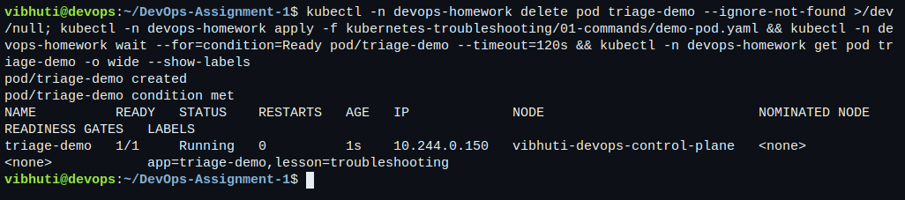
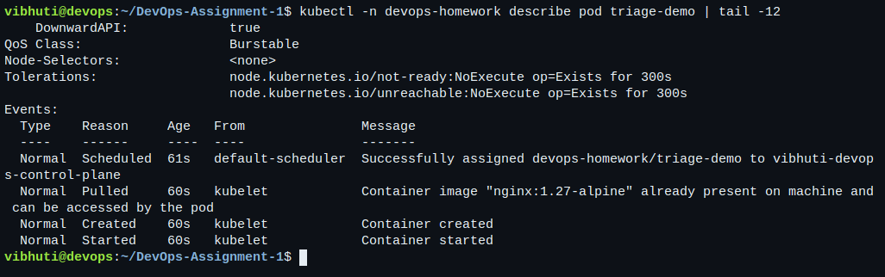
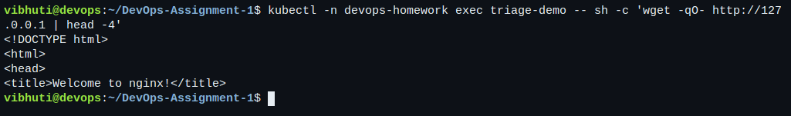
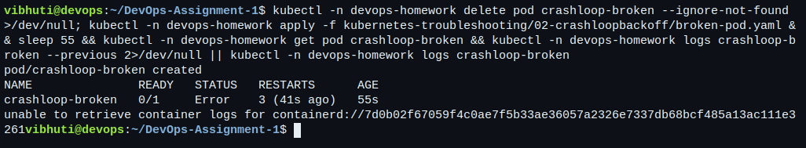
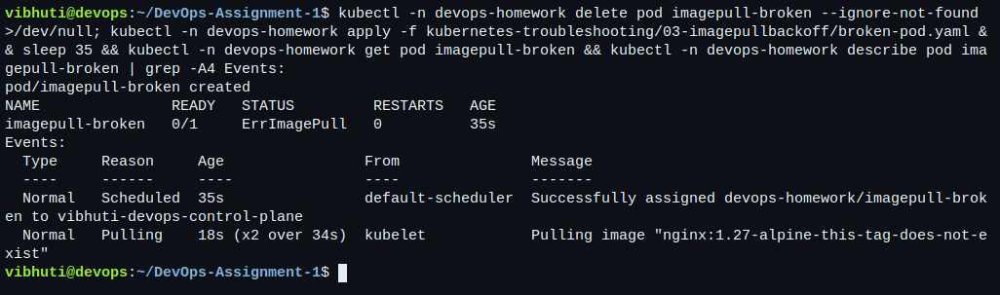
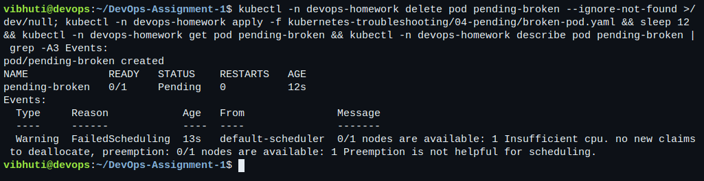
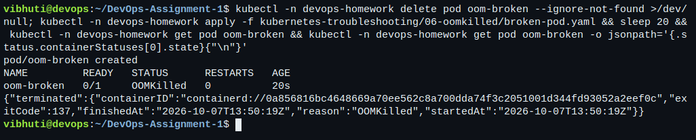
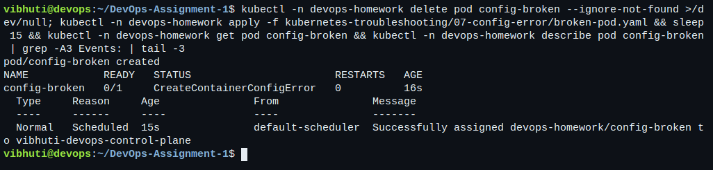
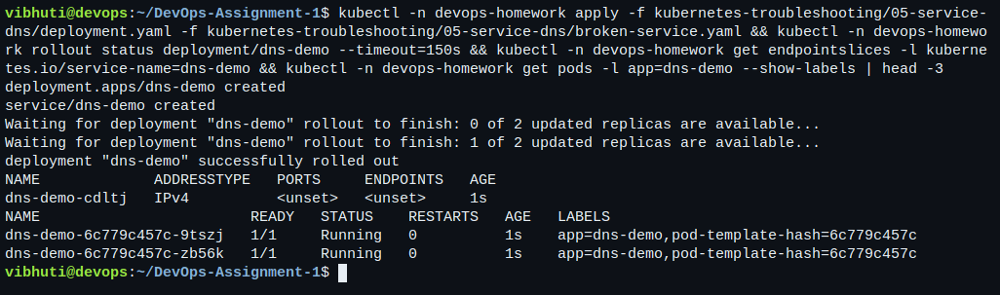
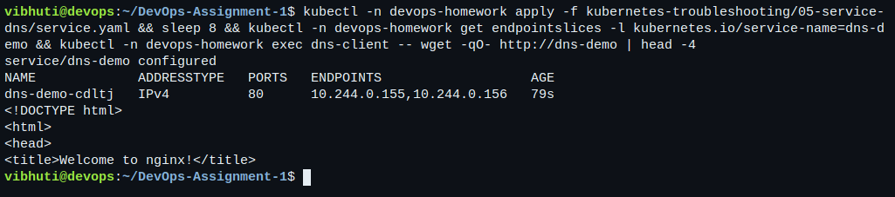

# Session 14: Kubernetes Troubleshooting

- **Name:** Vibhuti Bhatnagar
- **Roll no:** 24BCS10288
- **Email:** vibhuti.24bcs10288@sst.scaler.com
- **Batch:** B

Every failure below was created on purpose on the
[local lab cluster](../kubernetes-fundamentals/README.md#local-lab-setup), diagnosed with the
commands shown, and then fixed. The transcripts are
[10-troubleshooting.txt](../evidence/kubernetes/10-troubleshooting.txt) and
[11-triage-mini-project.txt](../evidence/kubernetes/11-triage-mini-project.txt).

```bash
bash scripts/run-kubernetes-labs.sh 10-troubleshooting 11-triage-mini-project
```

## Task 1: the commands

| Command | What it is for | What it will not tell you |
| --- | --- | --- |
| `kubectl get` | The current state of objects, one line each. First command, always. | Why that state happened. |
| `kubectl get -o wide` | Adds node, Pod IP and nominated node. | Same as above, with more columns. |
| `kubectl get --show-labels` | The labels a selector has to match. | — |
| `kubectl describe` | Spec, status and, at the bottom, the **Events**. The events are the reason to run it. | Anything the application wrote. |
| `kubectl logs` | What the process wrote to stdout and stderr. `--previous` reads the attempt before a restart. | Anything that happened before the container started. |
| `kubectl exec` | A shell inside a container that is already running. | Anything about a container that will not start. |
| `kubectl events` | Cluster events as a stream, filterable with `--for`. | Events older than the retention window, usually one hour. |
| `kubectl explain` | The schema of a field, straight from the API server. | — |
| `kubectl top` | Live CPU and memory, needs metrics-server. | Historical usage. |

The ordering matters more than the list. `get` says *what*, `describe` says *why the control plane
could not proceed*, `logs` says *why the process gave up*, and `exec` is only available once
something is actually running. Reaching for `logs` on a Pod that never started is the most common
wasted step.

```bash
kubectl -n devops-homework describe pod triage-demo
kubectl -n devops-homework logs triage-demo --tail=5
kubectl -n devops-homework exec triage-demo -- sh -c 'wget -qO- http://127.0.0.1 | head -4'
kubectl -n devops-homework events --for pod/triage-demo
kubectl -n devops-homework explain pod.spec.containers.resources
kubectl -n devops-homework top pod triage-demo
```

One practical note: `kubectl top` on a Pod created seconds ago returns
`podmetrics.metrics.k8s.io "…" not found`. That is not a broken metrics-server, it is a Pod younger
than the last scrape. The runner retries rather than reporting a failure.

## Task 2: the failures, one at a time

### CrashLoopBackOff — [02-crashloopbackoff/](02-crashloopbackoff/)

The container reads a configuration file that was never mounted and exits 1. The default
`restartPolicy: Always` restarts it, it fails again, and the kubelet starts spacing the restarts
out. That backoff is what the status is named after.

```bash
kubectl -n devops-homework get pod crashloop-broken
kubectl -n devops-homework describe pod crashloop-broken
kubectl -n devops-homework logs crashloop-broken --previous
```

```text
Warning  BackOff  kubelet  Back-off restarting failed container app in pod crashloop-broken
```

```text
starting app
cat: can't open '/etc/app/config.ini': No such file or directory
```

While the container is in backoff the *current* log is unavailable, which is exactly when
`--previous` matters. **Root cause:** the file the process needs is not in the image and no volume
supplies it. **Fix:** [fixed-pod.yaml](02-crashloopbackoff/fixed-pod.yaml) mounts a ConfigMap at
`/etc/app`; the container then prints the file and stays up.

CrashLoopBackOff is never the problem itself — it is the kubelet reporting that something else keeps
failing. The log from the previous attempt is where the actual problem is.

### ErrImagePull and ImagePullBackOff — [03-imagepullbackoff/](03-imagepullbackoff/)

The tag does not exist. The transcript catches both states: `ErrImagePull` on the first attempt,
then `ImagePullBackOff` once the kubelet starts waiting between retries.

```text
Warning  Failed  kubelet  Failed to pull image "nginx:1.27-alpine-this-tag-does-not-exist":
  failed to resolve reference: not found
Warning  Failed  kubelet  Error: ErrImagePull
Normal   BackOff kubelet  Back-off pulling image
```

**Root cause:** a tag that does not exist in the registry. **Fix:** the correct tag.

The same two statuses appear for a private registry with no `imagePullSecret` and for a rate-limited
pull. The event text is what distinguishes them — `not found` versus `unauthorized` versus
`toomanyrequests` — and it only appears in `describe`, never in `get`.

### Pending — [04-pending/](04-pending/)

The Pod requests 64 CPUs. No node can satisfy it, so the scheduler never places it.

```text
Warning  FailedScheduling  default-scheduler  0/1 nodes are available: 1 Insufficient cpu.
  preemption: 0/1 nodes are available: 1 Preemption is not helpful for scheduling.
```

```bash
kubectl get nodes -o custom-columns=NODE:.metadata.name,CPU:.status.allocatable.cpu,MEM:.status.allocatable.memory
```

**Root cause:** the request exceeds every node's allocatable CPU. **Fix:** a request the cluster can
actually meet. Pending always means the *scheduler* is stuck, and the reason is always in the
`FailedScheduling` event: insufficient resources, an unsatisfiable nodeSelector or affinity, a taint
with no matching toleration, or an unbound PersistentVolumeClaim.

### ContainerCreating and CreateContainerConfigError — [07-config-error/](07-config-error/)

The Pod is scheduled, so it is past `Pending`, but the kubelet cannot build the container because the
Deployment references a ConfigMap key that does not exist.

```text
NAME             READY   STATUS                       RESTARTS   AGE
config-broken    0/1     CreateContainerConfigError   0          3s

Warning  Failed  kubelet  Error: configmap "missing-config" not found
```

**Root cause:** a reference to an object that was never created. **Fix:** create the ConfigMap;
the Pod then starts and `printenv APP_MODE` prints `coursework`.

A Pod stuck in `ContainerCreating` for longer than a few seconds is the same family of problem: a
missing Secret or ConfigMap, a volume that will not attach, or an image still downloading. `describe`
distinguishes them; `get` cannot.

### OOMKilled — [06-oomkilled/](06-oomkilled/)

The container writes 80Mi into a tmpfs while its memory limit is 32Mi. The kernel kills it.

```text
NAME         READY   STATUS      RESTARTS   AGE
oom-broken   0/1     OOMKilled   0          3s

    Last State:   Terminated
      Reason:     OOMKilled
      Exit Code:  137
```

**Root cause:** the limit is below the working set. **Fix:** a 192Mi limit, after which the same
allocation finishes and the container logs `allocation finished`.

Exit code 137 is 128 + 9, the signal number for SIGKILL. Seeing 137 with no OOMKilled reason usually
means something else sent the kill — a liveness probe failure, or eviction.

### Service connectivity and DNS — [05-service-dns/](05-service-dns/)

The Pods are healthy and the Service selector matches nothing.

```bash
kubectl -n devops-homework get endpointslices -l kubernetes.io/service-name=dns-demo
kubectl -n devops-homework get pods -l app=dns-demo --show-labels
kubectl -n devops-homework describe service dns-demo
kubectl -n devops-homework exec dns-probe -- nslookup dns-demo.devops-homework.svc.cluster.local
```

The EndpointSlice is empty, the Pods carry `app=dns-demo`, and the Service selects `app=wrong-app`.
Critically, **DNS still works**:

```text
Name:      dns-demo.devops-homework.svc.cluster.local
Address 1: 10.96.x.y
```

The name resolves, the ClusterIP exists, and the connection is refused because there is nothing
behind it. Correcting the selector fills the slice with two addresses and the request succeeds.

The transcript also shows the opposite case — a Service name that does not exist returns NXDOMAIN
from the resolver, never a refused connection. That is the test that separates "DNS is broken" from
"the Service has no backends", and they need completely different fixes.

## Task 3: Mini project — [mini-project/](mini-project/)

The brief's Nginx application, its Service, a broken Pod and a broken selector.

### The troubleshooting table

| Problem | What I saw | Command I used | Root cause | Fix |
| --- | --- | --- | --- | --- |
| Broken Pod | `project-broken-pod  0/1  ImagePullBackOff` | `kubectl describe pod project-broken-pod` → `Failed to pull image "nginxx:latest"` | The image name is misspelled: `nginxx` is not a repository on Docker Hub. | Correct the image to `nginx:1.27-alpine`. |
| Service problem | `kubectl get endpointslices` for the Service returned no ready endpoints; the Service and its ClusterIP existed. | `kubectl get pods --show-labels` then `kubectl describe service troubleshooting-service` | The Service selected `app=wrong-app`; the Pods carry `app=troubleshooting-app`. | Restore the selector; both Pod addresses reappear immediately. |
| Image problem | The Pod never reached `Running`; events showed `ErrImagePull` then `ImagePullBackOff`. | `kubectl events --for pod/project-broken-pod` | A registry lookup for a repository that does not exist, retried with backoff. | Same as the broken Pod: fix the reference. A private image would instead need an `imagePullSecret`. |

### Questions from the brief

**1. What does `kubectl get` tell us?** The current state of objects as the API server holds it:
names, status, readiness, restarts, age. It is a snapshot, not an explanation.

**2. Difference between `get` and `describe`?** `get` is one line of status per object. `describe`
is the full spec and status plus the **Events** for that object, which is where the control plane
records *why* it could not do what was asked. Almost every "my Pod will not start" question is
answered by the bottom of `describe`.

**3. Why `kubectl logs`?** It is the only way to see what the process itself said. `describe` shows
what Kubernetes did; `logs` shows why the application gave up. `--previous` reads the attempt before
the last restart, which is the only copy that exists during a CrashLoopBackOff.

**4. When would you use `kubectl exec`?** When the container is running but behaving wrongly:
checking that an environment variable arrived, that a mounted file has the content you expected,
that a dependency resolves from inside the Pod's network namespace. It is useless for a container
that will not start, because there is nothing to exec into.

**5. What does `CrashLoopBackOff` mean?** The container has repeatedly started and exited, and the
kubelet is now waiting longer between each restart. It is a symptom. The cause is in
`logs --previous`.

**6. What does `ImagePullBackOff` mean?** The kubelet could not pull the image and is backing off
between retries. The first failure is reported as `ErrImagePull`; the backoff state follows.
Causes: wrong name or tag, private registry without credentials, or rate limiting.

**7. Why can a Pod remain `Pending`?** The scheduler has not placed it. Insufficient CPU or memory
on every node, an unsatisfiable `nodeSelector` or affinity rule, a taint with no matching toleration,
or a PersistentVolumeClaim that cannot bind. The `FailedScheduling` event names which.

**8. Why can a Service have no endpoints?** The selector matches no Pods, or it matches Pods that
are not Ready. Readiness matters as much as the selector — a Pod that is `Running` but `0/1` is
deliberately excluded.

**9. Relationship between a Service selector and Pod labels?** The selector is a query over labels.
The endpoint controller runs that query continuously and writes the matching, Ready Pod addresses
into an EndpointSlice. They are matched by exact key and value; there is no warning when they
disagree, which is why a typo produces a Service that looks perfectly healthy and routes nothing.

**10. What is Kubernetes DNS?** CoreDNS, running in `kube-system`, which gives every Service a name
of the form `<service>.<namespace>.svc.cluster.local` and is configured as the nameserver in every
Pod. It is covered in detail in [the Session 11 CoreDNS notes](../kubernetes-services/coredns/README.md).

## The order I use

```text
get  →  describe (read the Events)  →  logs (--previous if it restarted)  →  exec  →  test  →  fix  →  verify
```

For anything that looks like a connectivity problem, add one step before the rest:

```bash
kubectl get endpointslices -l kubernetes.io/service-name=<service>
```

An empty slice turns a vague network problem into a specific labelling problem, and it takes one
command to find out.

## Terminal captures

Live captures. Every failure below was created on purpose and diagnosed with the commands shown.

**Task 1 — `get` with `-o wide` and `--show-labels`: the first command in any investigation.**



**Task 1 — the Events at the bottom of `describe`, which is where the control plane says why it could not proceed.**



**Task 1 — `exec` into a running container to test it from the inside.**



**CrashLoopBackOff — and the log from the previous attempt, which is the only place the real error appears.**



**ImagePullBackOff — the tag does not exist, and only the Events say so.**



**Pending — the scheduler reports `Insufficient cpu`; no node can satisfy the request.**



**OOMKilled — exit code 137, which is 128 + SIGKILL.**



**CreateContainerConfigError — the Pod is scheduled, but a referenced ConfigMap does not exist.**



**A Service whose selector matches nothing: healthy Pods, an empty EndpointSlice, and a mismatch visible in the labels.**



**The same Service after the selector is corrected — endpoints appear and the request succeeds.**


## Cleanup

The sections clean up after themselves. The shared `devops-homework` namespace is left in place for
the other sessions.
