# Session 20: Monitoring, Observability & GitOps

- **Name:** Vibhuti Bhatnagar
- **Roll no:** 24BCS10288
- **Email:** vibhuti.24bcs10288@sst.scaler.com
- **Batch:** B

A monitoring stack that was actually run, an alert that actually fired and resolved, and Argo CD
reconciling a live cluster back to Git twice. Transcripts:
[20-monitoring-stack.txt](../evidence/monitoring/20-monitoring-stack.txt) and
[13-gitops.txt](../evidence/kubernetes/13-gitops.txt).

```bash
bash scripts/run-monitoring-lab.sh                      # Prometheus, Alertmanager, Grafana
bash scripts/run-kubernetes-labs.sh 13-gitops           # Argo CD in the kind cluster
```

## Task 1: Monitoring

### The stack

| Component | Role |
| --- | --- |
| Prometheus | Scrapes targets, stores time series, evaluates alert rules. |
| node-exporter | Host CPU, memory, disk and network. |
| cAdvisor | Per-container CPU and memory. |
| The Notes application | Its own `/metrics` endpoint — the [final project's service](../final-devops-project/README.md). |
| Alertmanager | Groups, inhibits and routes what fires. |
| Grafana | Provisioned datasource and dashboard, no click-ops. |

```bash
docker compose -f monitoring-observability-gitops/monitoring/docker-compose.yml up -d
```

All four scrape targets up:

```text
job         scrapeUrl                           health
containers  http://cadvisor:8080/metrics        up
node        http://node-exporter:9100/metrics   up
notes-app   http://demo-app:8000/metrics        up
prometheus  http://localhost:9090/metrics       up
```

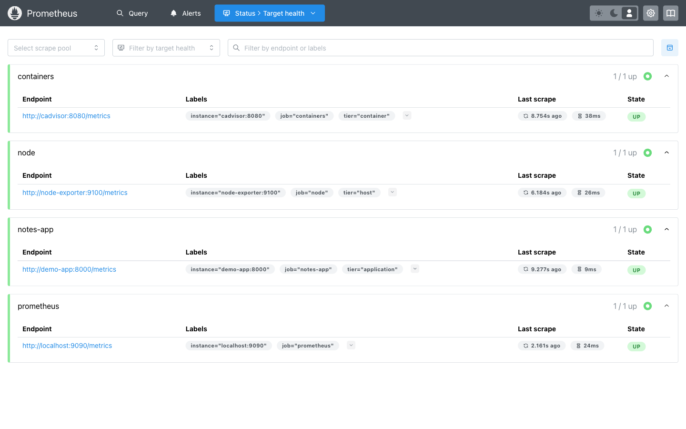

### Metrics

Infrastructure metrics, read back through PromQL rather than screenshotted from a dashboard:

```text
$ promql 100 - (avg(rate(node_cpu_seconds_total{mode="idle"}[2m])) * 100)
host CPU utilisation: 81.94%

$ promql (1 - node_memory_MemAvailable_bytes / node_memory_MemTotal_bytes) * 100
host memory in use: 86.63%

$ promql topk(5, container_memory_working_set_bytes{id=~"/docker/.+"})
/docker/a2f7ba6187eff…               1497 MiB
/docker/e2425f3208ecd…               1186 MiB
/docker/e2425f3208ecd…/kubelet.slice  993 MiB
/docker/ce591695362104…               885 MiB
```

Those host figures are high because the kind cluster, LocalStack and the rest of this homework were
all running on the same laptop at the time. They are the real readings, not a quiet moment chosen to
look tidy.

There is no CPU metric; there is a *counter of seconds spent in each mode*. `rate(...[2m])` turns it
into seconds-per-second — a fraction — and 100 minus the idle fraction is utilisation. Every CPU
panel in every dashboard is that expression.

### Application health

Infrastructure metrics say the container is alive. They cannot say whether it is doing its job. The
application exports its own:

```text
notes_stored_total 3.0
notes_storage_writable 1.0

$ promql sum by (endpoint) (notes_http_requests_total)
healthz  3 requests
metrics  3 requests
```

Three notes were created through the API during the run and Prometheus counted three.
The request counters are per-process and the stack had only just started, so the numbers are small;
what they show is that the application's own instrumentation reaches Prometheus. That is the
difference between monitoring a process and monitoring a service: `notes_storage_writable` going to
0 means the volume stopped accepting writes, which no amount of CPU and memory data would reveal.

### Grafana

Datasource and dashboard are both provisioned from files, so the stack comes up complete:

```text
datasource: Prometheus (prometheus) -> http://prometheus:9090, default: true
dashboard: DevOps homework overview (uid devops-overview)
Grafana queried Prometheus through its datasource: 4 targets up
```

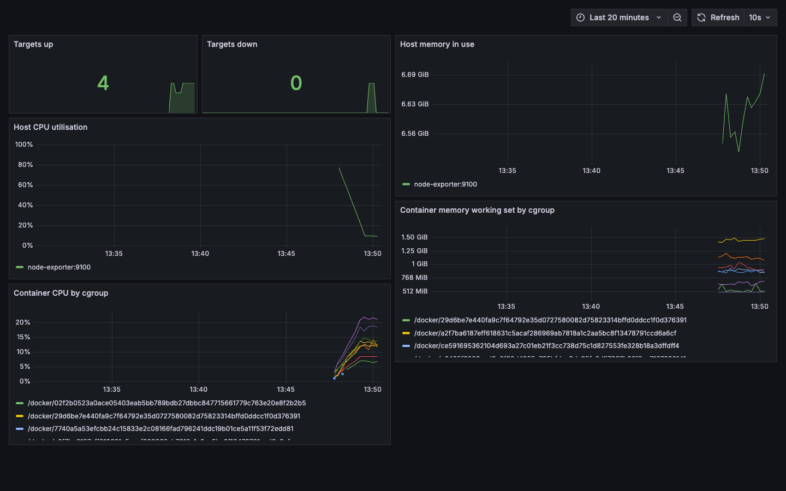

A note on the two container panels: on Docker Desktop, cAdvisor cannot read the overlay layer
database, so it never resolves container *names* and every series is identified by its cgroup id
instead. The panels and the `ContainerHighMemory` rule filter on `id` for that reason; on a Linux
host the `name` label is populated normally. It is recorded here rather than quietly worked around,
because "No data" in a panel is exactly the kind of thing that gets ignored until an incident.

### Alerts

Four rules across three groups. The alert path was exercised end to end by stopping the application
container:

```text
active alerts: 0                         ← healthy
$ docker stop devops-demo-app
PASS: TargetDown entered the pending state
TargetDown  job=notes-app  pending
PASS: TargetDown moved from pending to firing after its 30s wait
TargetDown  job=notes-app  firing  notes-app target demo-app:8000 is not responding
PASS: Alertmanager received the firing alert
$ docker start devops-demo-app
PASS: the alert resolved once the target answered again
active alerts: 0
```

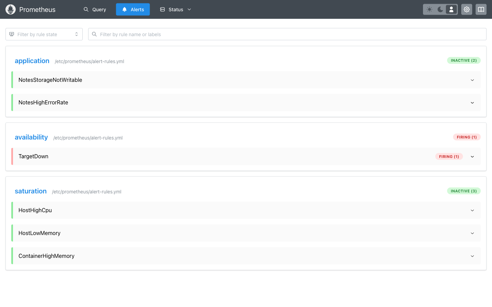

`for: 30s` is what produces the `pending` state: the condition must hold continuously before the
alert fires. Without it, a single missed scrape pages someone. That one field is most of the
difference between an alert people trust and an alert people mute.

Alertmanager's `inhibit_rules` suppress the `warning` saturation alerts for an instance while a
`critical` alert is firing for it — a host that is down does not need three alerts saying its CPU
reading is stale. Its receiver is a webhook that goes nowhere on purpose; a real Slack or PagerDuty
URL is a credential and does not belong in a public repository.

## Task 2: Observability

### The three pillars

| Pillar | Answers | Cost | Cardinality |
| --- | --- | --- | --- |
| **Metrics** | "Is something wrong, and how wrong?" | Cheap, fixed per series | Must stay low |
| **Logs** | "What exactly happened in this request?" | Expensive at volume | Unbounded |
| **Traces** | "Where did the time go across services?" | Expensive; usually sampled | Per request |

Metrics are numbers aggregated over time. Cheap to store, cheap to query, and they cannot tell you
*which* user was affected. Adding a user id as a label is the classic cardinality explosion: a
million users means a million series.

Logs are events with full context. They answer the question metrics raise, and they are the first
thing to become unaffordable — which is why structured logs with sampling beat free-text logs at
volume.

Traces follow one request across service boundaries, with a span per hop. They are the only one of
the three that answers "which service made this slow" in a system with more than a couple of
services.

### Why observability rather than monitoring

Monitoring checks conditions somebody thought of in advance. Observability is whether the system
emits enough to answer questions nobody thought of in advance.

The practical difference shows up during an incident. "Is CPU high?" is monitoring, and the dashboard
was built for it. "Why are 2% of requests slow, but only for one customer, only on one endpoint, only
since Tuesday?" was not on the dashboard — answering it requires the data to exist at the right
granularity, with labels that let it be sliced.

### Tools

| Pillar | Common choices |
| --- | --- |
| Metrics | Prometheus, VictoriaMetrics, CloudWatch, Datadog |
| Logs | Loki, Elasticsearch, CloudWatch Logs, Splunk |
| Traces | Jaeger, Tempo, Zipkin, X-Ray |
| All three | Grafana for display, OpenTelemetry for collection |

OpenTelemetry matters because it decouples instrumentation from the backend: instrument once, change
vendor without touching the application.

### Kubernetes observability

| Signal | Where it comes from |
| --- | --- |
| Pod and container metrics | kubelet's cAdvisor endpoint, via metrics-server or Prometheus |
| Cluster object state | kube-state-metrics — replica counts, Pod phases, restart counts |
| Application metrics | The Pod's own `/metrics`, discovered by annotation |
| Logs | `kubectl logs`, or a DaemonSet collector shipping to Loki or Elasticsearch |
| Events | `kubectl get events` — the control plane's own narrative |

[The final project's in-cluster Prometheus](../final-devops-project/monitoring/prometheus-k8s.yaml)
discovers targets from the Kubernetes API rather than a static list:

```yaml
kubernetes_sd_configs:
  - role: pod
relabel_configs:
  - source_labels: [__meta_kubernetes_pod_annotation_prometheus_io_scrape]
    action: keep
    regex: "true"
```

Any Pod carrying `prometheus.io/scrape: "true"` is scraped. Nothing has to be registered, and a
scaled-out Deployment is picked up automatically:

```text
job                scrapeUrl                     health
kubernetes-pods    http://10.244.0.83:8000/metrics   up
kubernetes-pods    http://10.244.0.84:8000/metrics   up

$ promql notes_stored_total
pod notes-7f7c4d88bd-fs4jc stored notes: 3
pod notes-7f7c4d88bd-vljv7 stored notes: 3
```

Both replicas report 3, which is itself a result: they share one PersistentVolumeClaim.

## Task 3: GitOps

### What it is

The cluster's desired state lives in Git, and a controller inside the cluster continuously makes
reality match it. Four properties follow:

| Property | Consequence |
| --- | --- |
| Git is the source of truth | The repository, not the cluster, is the answer to "what should be running". |
| Declarative configuration | The repository describes the end state, not the steps. |
| Continuous reconciliation | Drift is corrected automatically, not at the next deploy. |
| Pull, not push | The agent runs *inside* the cluster. No pipeline needs cluster credentials. |

The last one is the real security argument. In the [Session 16 CD workflow](../.github/workflows/cd.yml)
a GitHub runner holds a kubeconfig in `secrets.KUBE_CONFIG`. With GitOps that secret does not exist:
the pipeline's last act is a commit.

### The demo

```bash
kubectl apply -f monitoring-observability-gitops/gitops/guestbook-application.yaml
```

```text
NAME        SYNC STATUS   HEALTH STATUS   REVISION                                   PROJECT
guestbook   Synced        Healthy         8088f4c0d970abb09e250248cc97e35623447cb5   default
```

The Application points at a public example repository rather than this one, so the demo does not
depend on this homework being pushed first. [The final project's own Application](../final-devops-project/gitops/application.yaml)
points at `final-devops-project/kubernetes` in this repository and is applied after a push.

### Continuous reconciliation, demonstrated twice

Argo CD syncing once is not interesting. Putting the cluster back is.

**Drift:**

```bash
kubectl -n guestbook scale deployment/guestbook-ui --replicas=5
```

```text
PASS: Argo CD reverted the hand-made change back to the Git revision
```

Scaled to 5 by hand; `selfHeal` returned it to the 1 that Git specifies. `kubectl scale` is not a
deployment mechanism any more — it is drift, and it is undone.

**Deletion:**

```bash
kubectl -n guestbook delete service guestbook-ui
```

```text
PASS: Argo CD recreated the Service it manages
```

Deleting a managed resource is also drift. Recovery is the controller noticing that Git says the
Service exists.

### The sync policy

```yaml
syncPolicy:
  automated:
    prune: true      # resources removed from Git are deleted from the cluster
    selfHeal: true   # changes made against the cluster are undone
  syncOptions:
    - CreateNamespace=true
  retry:
    limit: 5
    backoff: { duration: 5s, factor: 2, maxDuration: 1m }
```

`prune` is the one to think about before enabling. Without it, deleting a manifest from Git leaves
the object running forever. With it, an accidental deletion in Git deletes it from the cluster — but
a mistaken deletion is recoverable with `git revert`, and an invisible orphan is not.

[The final project's Application](../final-devops-project/gitops/application.yaml) adds one more
thing worth copying:

```yaml
ignoreDifferences:
  - group: apps
    kind: Deployment
    jsonPointers: [/spec/replicas]
```

Without it, Argo CD and the HorizontalPodAutoscaler fight: the HPA scales to 4, Argo sees a
difference from the 2 in Git and scales back, the HPA scales out again. `ignoreDifferences` concedes
that one field to the autoscaler.

### The workflow

```text
developer                  Git                      cluster
    │                       │                          │
    ├─ change image tag ───▶│                          │
    │  open a pull request  │                          │
    │                       │◀─ review, CI, merge      │
    │                       │                          │
    │                       │◀────── Argo CD polls ────┤
    │                       │                          │
    │                       ├─ new revision ──────────▶│ sync
    │                       │                          │ health check
    │                       │                          │
    │  rollback = git revert│                          │ reconcile continuously
```

A deployment is a merged pull request. A rollback is `git revert`. Who deployed what and when is
`git log`, with review and approval already attached.

### Where GitOps is a poor fit

- **Secrets.** Plain manifests in Git cannot carry them. Sealed Secrets, SOPS or an External Secrets
  operator are needed. [The final project](../final-devops-project/kubernetes/02-secret.yaml) creates
  its token out of band and the manifest carries only a placeholder.
- **Anything that must be ordered across repositories.** Reconciliation is eventually consistent.
- **One-off operational tasks.** A database migration is not a desired state.

## Terminal captures

Live captures, taken in a browser-attached terminal. The Grafana and Prometheus browser screenshots are above; these show the in-cluster Prometheus and the Argo CD reconciliation.

**Prometheus running inside the cluster, with its own ServiceAccount and read-only ClusterRole.**

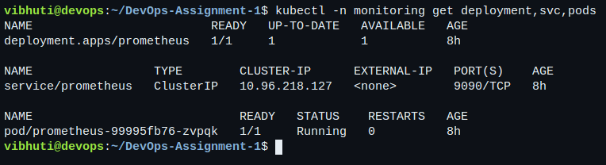

**The service-discovery configuration: any Pod carrying the `prometheus.io/scrape` annotation is scraped, with no static target list.**

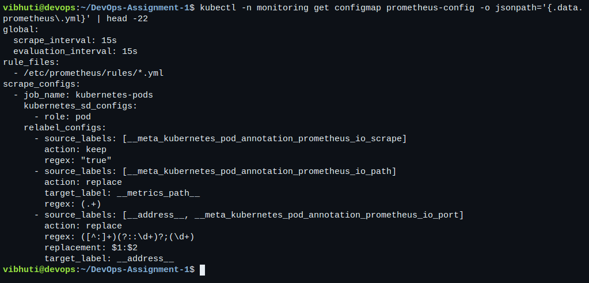

**The targets discovery actually found, with their health.**

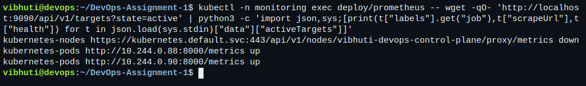

**The application's own metric, read back through Prometheus — one series per replica.**

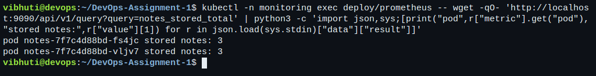

**The alert rules, loaded and inactive.**

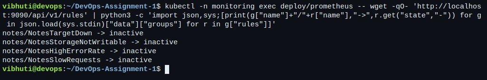

**Argo CD running in the cluster.**

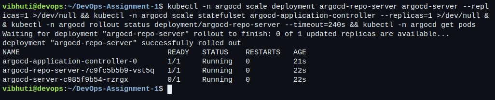

**The Application reporting `Synced` and `Healthy` against the Git revision it deployed.**

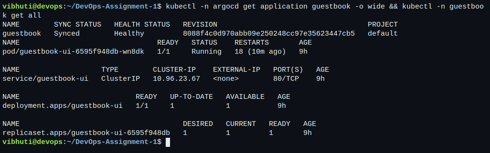

**Continuous reconciliation: the Deployment is scaled to 5 by hand, and Argo CD returns it to the 1 that Git specifies. `kubectl scale` is drift, not a deployment mechanism.**

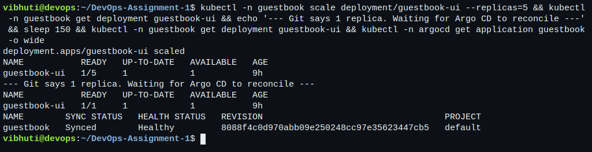

**The same for deletion — a managed Service removed by hand is recreated.**

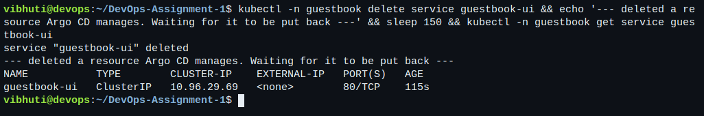
## Stopping everything

```bash
docker compose -f monitoring-observability-gitops/monitoring/docker-compose.yml down -v
kubectl --context=kind-vibhuti-devops delete -f monitoring-observability-gitops/gitops/guestbook-application.yaml
kubectl --context=kind-vibhuti-devops delete namespace argocd
```

The Application's `resources-finalizer.argocd.argoproj.io` finalizer means deleting it also deletes
what it created, so no orphans are left in the `guestbook` namespace.
