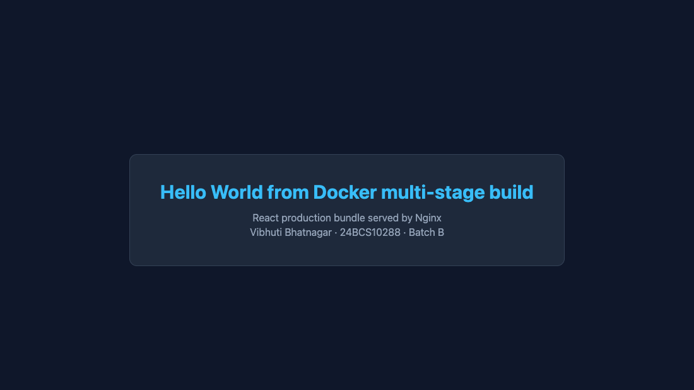

# Docker multi-stage build

- **Name:** Vibhuti Bhatnagar
- **Roll no:** 24BCS10288
- **Batch:** B

## Task 1 — run a multi-stage Dockerfile on port 8080

I did this twice: once with the Dockerfile from the session repository, and once with my own.

### (a) The session repository

```bash
git clone --depth 1 https://github.com/Nency-Ravaliya/devops-heros.git
cd devops-heros
docker build -t upstream-multi-stage ./session6-7-docker/multi-stage-dockerfile
docker run --rm -d --name upstream-multi-stage -p 8080:3000 upstream-multi-stage
curl http://localhost:8080
docker ps --filter name=upstream-multi-stage
docker stop upstream-multi-stage
```

That application listens on **3000** inside the container, so it is published as `-p 8080:3000`
to meet the "running on port 8080" requirement. The response was:

```html
<h1>Hello World from Docker Multi-Stage Build!</h1>
```

and `docker ps` reported `0.0.0.0:8080->3000/tcp`.

### (b) My own multi-stage Dockerfile

[`Dockerfile`](Dockerfile) in this folder. Stage 1 uses Node and Vite to build a React bundle;
stage 2 copies only `dist/` onto Nginx, so Node, npm, `node_modules`, and the source tree never
reach the final image.

```bash
docker build -t vibhuti-multi-stage .
docker run --rm -d --name vibhuti-multi-stage -p 8080:80 vibhuti-multi-stage
curl -I http://localhost:8080
docker ps --filter name=vibhuti-multi-stage \
  --format 'table {{.Names}}\t{{.Status}}\t{{.Ports}}'
docker stop vibhuti-multi-stage
```

The page at http://localhost:8080 shows **Hello World from Docker multi-stage build**, and
`docker ps` reported `0.0.0.0:8080->80/tcp`.



## Task 2 — documentation

| Field | Value |
| --- | --- |
| Name | Vibhuti Bhatnagar |
| Roll no / enrollment number | 24BCS10288 |
| Batch | B |
| Application URL | http://localhost:8080 |
| Page text | Hello World from Docker multi-stage build |
| `docker ps` ports column | `0.0.0.0:8080->80/tcp` |

The screenshot above shows the running application. The full command transcript, including the
`docker ps` output for both containers, is in [verification.txt](verification.txt).

## Why the second stage is worth it

I built the same source both ways to measure the difference:

| Build | Final image size |
| --- | ---: |
| Multi-stage (`node` build → `nginx` runtime) | **76.1 MB** |
| Single stage (everything kept in the `node` image) | 449 MB |

About **6× smaller**. The single-stage image is only a measurement, so it is not committed here.
The saving comes from three things:

1. The final image has no Node.js runtime or npm.
2. `node_modules` — by far the largest directory — stays in the builder stage.
3. The source tree is not shipped, only the compiled `dist/` output.

There is a security benefit too: a smaller runtime image has fewer packages, so there is less in
it that can carry a vulnerability, and the application source is not readable inside a running
container.

## Task 3 — three different application types

Node.js, Python, and Java, built from [`../docker-apps`](../docker-apps) and run at the same time:

```bash
docker run --rm -d --name t3-node   -p 8201:3000 vibhuti-node
docker run --rm -d --name t3-python -p 8202:5000 vibhuti-python
docker run --rm -d --name t3-java   -p 8203:8080 vibhuti-java
docker ps --filter name=t3-
docker stop t3-node t3-python t3-java
```

All three returned HTTP 200 with their own Hello World page. The transcript is in
[verification.txt](verification.txt), and the individual pages and Dockerfiles are documented in
[../docker-apps/README.md](../docker-apps/README.md).
